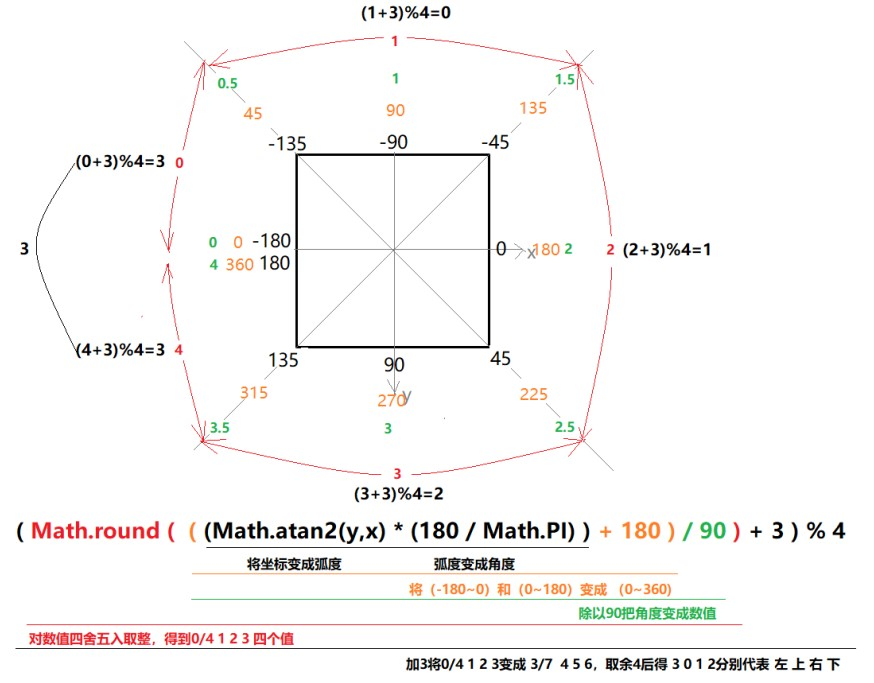

# CSS

## 1. 核心原理

1. 优先原则：后解析的内容会覆盖之前解析的内容
   * 同一个选择器：从上往下执行 解析
   * 同一类型的选择器：从上往下
   * 不同类型的选择器：先解析低优先级的，再解析高优先级的
   * 外部样式、内部样式合并之后一起解析，先外部再内部
   * 内联样式：外部+内部解析完了之后，才解析内联样式
   * 加了 `!important` 字段的最后执行
2. 继承原则：嵌套里面的标签拥有外部标签的某些样式，子元素可以继承父元素的属性
   * 跟文字、文本相关的样式可以被继承
   * 块级元素 宽度没设置的继承父元素的宽度，高度由内容决定


## 2. 选择器

**组合选择器**

```css
/* 以逗号分隔 */
div, p {
   
}
```


**嵌套选择器**

```css
/* 以空格隔开，嵌套在div里面的p */
div p {
    
}
```


**子选择器**

```css
/* div的直接子元素p */
div > p {
 
}
```


**相邻同级选择器**

```css
/* 与div相邻的p */ 
div + p {

}
```


**属性选择器**

`p[title]` 有 title 属性的 p

`p[title=qiu]` title=qiu 的 p

`p[title~=qiu]` title 的值里有 qiu 这个值的 p

`p[title^=qiu]` title 的值以 qiu 开头的 p

`p[title$=qiu]` title 的值以 qiu 结尾的 p

`p[title*=qiu]` title 的值里有 qiu 这个字符的 p


**伪元素选择器**

伪元素用于向某些选择器设置特殊效果

`::first-letter` 向文本的第一个字母添加特殊样式

`::first-line` 向文本的首行添加特殊样式

`::before` 在元素的内容之前插入内容

`::after` 在元素的内容之后插入内容


## 3. 背景

`background: color image repeat attachment position;`

`background-attachment: fixed;` 背景图像是否固定或者随着页面的其余部分滚动


## 4. 字体

`font: style weight size/line-height family;` 至少要有 size 和 family

`font-family` 字体系列

`font-size` 字体尺寸

`font-weight:lighter|normal|bold;` 字体粗细

`font-style: normal|italic;` 字体风格


## 5. 文本

`letter-spacing` 字间隔

`word-spacing` 字母间隔

`direction: ltr|rtl;` 文本方向

`text-decoration: none|underline|overline|line-through|blink;` 文本装饰

`text-align: left|center|right|justify;` 水平对齐

`text-indent` 缩进

`text-transform: none|uppercase|lowercase|capitalize;` 字符转换

`vertical-align: top|middle|bottom;` 垂直对齐

超出文本显示省略号

```css
{
    white-space: nowrap;
    overflow: hidden;
    text-overflow: ellipsis;
}
```


## 6. 链接状态样式及列表样式

**链接的四种状态**

- `a:link` - 正常，未访问过的链接
- `a:visited` - 用户已访问过的链接
- `a:hover` - 当用户鼠标放在链接上时
- `a:active` - 链接被点击的那一刻


**列表样式**

`list-style-type`


## 7. 盒子模型

解决 margin 重叠的方法

1. 平级的元素
   * float
   * display: inline-block

2. 嵌套关系
   * border
   * padding
   * overflow: hidden


## 8. 清理浮动和margin

```css
/* 清理浮动 */
.container::after {
    content: "";
    display: block;
    clear: both;
}

/* 清理浮动和margin */
.container::before,
.container::after {
    content: "";
    display: table;
}
.container::after {
    clear: both;
}
```


## 9. 定位

`position: static|relative|absolute|fixed;`

* static：默认值，即没有定位，元素出现在正常的流中

* relative：相对定位元素的定位是相对其正常位置

* absolute：绝对定位的元素的位置相对于最近的已定位父元素

* fixed：元素的位置相对于浏览器窗口是固定位置


## 10. 选择器权重	256 进制

无限大 `!important` => 1000 行间样式 => 100 id选择器 => 10 class选择器｜属性选择器｜伪类选择器 => 1 标签选择器｜伪元素选择器 => 0 通配符选择器 *


## 11. CSS3 常用选择器

**属性选择器**

`E[att]` 用于选取带有 att 属性的元素 E

`E[att="val"]` 属性 att 的值为 "val" 的元素

`E[att~="val"]` 属性 att 的值中有 "val" 的元素

`E[att^="val"]` 属性 att 的值以 "val" 开头的元素

`E[att$="val"]` 属性 att 的值以 "val" 结尾的元素

`E[att*="val"]` 属性 att 的值包含 "val" 的元素


**同级选择器**

`E + F` 毗邻元素选择器，匹配所有紧随 E 元素之后的同级元素 F

`E ~ F` 匹配任何在 E 元素之后的同级 F 元素，兄弟选择器


**伪类选择器**

| 选择器               | 描述                                   |
| -------------------- | -------------------------------------- |
| :not(s)              | 选择非 s 元素的每个元素                |
| :first-child         | 选择父元素的第一个子元素               |
| :last-child          | 选择父元素的最后一个子元素             |
| :nth-child(n)        | 选择父元素的第 n 个子元素              |
| :nth-last-child(n)   | 选择父元素的倒数第 n 个子元素          |
| :first-of-type       | 选择父元素的第一个同类型的子元素       |
| :last-of-type        | 选择父元素的最后一个同类型的子元素     |
| :nth-of-type(n)      | 选择父元素的第 n 个同类型的子元素      |
| :nth-last-of-type(n) | 选择父元素的倒数第 n 个同类型的子元素  |
| :empty               | 选择内容为空的元素                     |
| :enable              | 选择表单中启用元素                     |
| :disabled            | 选择表单中禁用元素                     |
| :checked             | 选择表单中选中的元素 radio \| checkbox |
| :target              | 选中当前活动的元素                     |
| :root                | 选中文档的根元素                       |
| :focus               | 选择获得焦点的 input 元素              |


**伪元素选择器**

`::first-letter` 选择元素的首字符

`::first-line` 选择元素的首行 

`::before` 在元素的内容之前插入内容	

`::after` 在元素的内容之后插入内容

`::selection` 选择被用户选取的元素部分


## 12. CSS3 常用属性

`border-radius` 圆角，指定圆角可以使用以下规则：

* **一个值**：四个圆角值相同
* **两个值**：第一个值为左上角与右下角，第二个值为右上角与左下角
* **三个值**：第一个值为左上角，第二个值为右上角和左下角，第三个值为右下角
* **四个值**：依次为左上角、右上角、右下角、左下角

`box-shadow` 盒子阴影（性能杀手）

```css
box-shadow: x y 模糊半径 阴影尺寸 阴影颜色 投影方式(默认 outset 外阴影|inset 内阴影);
```

`text-shadow` 文字阴影（性能杀手）

```css
text-shadow: x y 模糊半径 阴影颜色;
```

`rgba(r, g, b, a)` 注意与 `opacity` 的区别

`transparent` 透明


**线性渐变**

```css
background: linear-gradient(渐变方向, 渐变颜色 百分比, 渐变颜色 百分比);
```

**径向渐变**

```css
background: radial-gradient(形状circle|ellipse r|a b at 中心点位置, 渐变颜色 百分比, 渐变颜色 百分比);
```


**新增 background 值：**

`background-origin` 指定绘制背景图像时的起点

```css
background-origin: padding-box(默认)|border-box|content-box;
```

`background-clip` 指定背景的显示范围

```css
background-clip: border-box(默认)|padding-box|content-box;
```

`background-size` 指定背景中图像的尺寸

```css
background-size: auto|length(像素宽高)|percentage(百分比宽高)|cover|contain;
```

cover：用一张图片铺满盒子

contain：让盒子保留一张完整的背景图片


**新增 border 值：**

给 border 添加背景图片

```css
border-image: url number(图片裁剪的值) style(图片添加的样式);
```


**文字属性：文本溢出**

```css
text-overflow: clip|ellipsis|ellipsis-word;
```

clip：不显示省略标记（...）而是简单裁切

ellipsis：当对象文本溢出时显示省略标记（...），省略标记插入的位置是最后一个字符

`white-space: nowrap` 文本不会换行，直到遇到 \<br> 标签为止


**单行打点：**

```css
text-overflow: ellipsis;	
white-space: nowrap;	/* 强制文本在一行内显示 */
overflow: hidden;	/* 溢出内容隐藏 */
```

**多行打点：**

```css
-webkit-line-clamp: 2;
text-overflow: ellipsis;
display: -webkit-box;
-webkit-box-orient: vertical;	/* 子元素被垂直排列 */
overflow: hidden;
```

多行打点兼容性不好，可用 JS 操作


**文字属性：文本换行**

```css
word-wrap: normal|break-word;
```

normal：连续文本换行

break-word：内容将在边界内换行（强制换行）


**文字属性：文字字体**

```css
@font-face {
    font-family: "ShadowslntoLight";
    src: url("./ShadowslntoLight.ttf");	/* 兼容IE */
    src: url("./ShadowslntoLight.eot?#iefix") format("embedded-opentype"),
         url("./ShadowslntoLight.woff") format("woff"),
         url("./ShadowslntoLight.ttf") format("truetype"),
         url("./ShadowslntoLight.svg") format("svg");
}
```


## 13. 盒模型

 `box-sizing` 定义显示方式

```css
box-sizing: content-box(默认)|border-box(IE6混杂盒模式)
```

`resize` 可控大小

```css
resize: none(默认)|horizontal(可调整宽度)|vertical(可调整高度)|both(宽高皆可调整)
overflow: auto;     /* 结合属性 */
```

`outline` 定义轮廓

```css
outline: width style color;
```


## 14. Columns 多列布局

```css
column-width: 每列的宽度;
column-count: 显示的列数;
column-gap: 列宽(默认由font-size决定);
column-rule: width style color;	  /* 列之间的宽度、样式和颜色 */
column-span: none|all(横跨所有列);
```


## 15. Flex 弹性盒子

**初始效果**

所有 CSS 属性都会有一个初始值，所有 flex 容器中的所有 flex 元素都会初始默认效果：

1. 主轴水平从左向右，元素排列为一行（`flex-direction: row;`）
2. 元素从左边起始线开始（`justify-content: flex-start;`）
3. 默认不拉伸（`flex-grow: 0;`），但是会压缩（`flex-shrink: 1;`）不换行（`flex-wrap: nowrap;`）。元素不会在主纬度方向拉伸，但是可以缩小
4. 不设置高度时 flex 元素充满 flex 容器（`align-items: stretch;`），元素被拉伸来填充交叉轴


**flex 容器属性**

* `flex-direction` 设置 flex 容器主轴的方向

  row：默认方向水平从左到右

  row-reverse：水平从右到左

  column：垂直从上到下

  column-reverse：垂直从下到上

* `flex-wrap` 控制 flex 容器是单线还是多线，以及新线的堆叠方向

  nowrap：单行

  wrap：多行

  wrap-reverse：新线上前排列

* flex-flow: flex-direction flex-wrap;

* `justify-content` 项目在主轴上的对齐方式

  flex-start：默认向主轴起始点对齐

  flex-end：向主轴结束点对齐

  center：居中对齐

  space-between：两端对齐，每两个 flex 元素之间的距离相等

  space-around：每个 flex 元素两侧的距离相等

* `align-items` 项目在交叉轴上的对齐方式

  flex-start

  flex-end

  center

  baseline：flex 元素的第一行文本为基准对齐

  stretch：flex 元素未设置高度时，高度充满 flex 容器高度

* `align-content` 多线的对齐方式，单线不起作用

  flex-start

  flex-end

  center

  stretch：flex 元素未设置高度时，高度充满交叉轴

  space-between：交叉轴两端对齐，每两个 flex 元素之间的距离相等

  space-around：每根轴两侧距离相等


**flex 元素属性**

* `flex-basis` 定义该元素在主轴方向的尺寸

* `flex-grow` 拉伸比例，默认值为 0

* `flex-shrink` 压缩比例，默认值为 1

* flex: flex-grow flex-shrink flex-basis;  默认值 0 1 auto

* `align-self` 单个项目在交叉轴上的对齐方式

  flex-start

  flex-end

  center

  baseline：flex 元素的第一行文本为基准对齐

  stretch：flex 元素未设置高度时，高度充满 flex 容器高度

* `order: number` 该项目排列的位置，值从小到大排列


## 16. 水平垂直居中

已知宽高

```css
/* 第一种方法 */
.wrapper { 
    position: relative;
}
.box { 
    position: absolute;
    top: 50%;
    left: 50%;
    margin-top: -100px;
    margin-left: -100px;
    width: 200px;
    heigth: 200px;
}

/* 第二种方法 */
.wrapper {
    position: relative;
}
.box {
    position: absolute;
    top: 0;
    left: 0;
    right: 0;
    bottom: 0;	
    margin: auto;
    width: 200px;
    height: 200px;		
}
```

未知宽高

```css
/* 第一种方法 */
.wrapper {
    position: relative;
}
.box {
    position: absolute;
    top: 50%;
    left: 50%;	
    transform: translate(-50%, -50%);		
}

/* 第二种方法 */
.wrapper {
    display: flex;
    justify-content: center;
    align-items: center;
}
```


## 17. 媒体查询

媒体类型：媒体查询中指定的媒体类型匹配展示文档所使用的设备类型

媒体特性：媒体特性表达式（0 或多个）最终会被解析为 true 或 false

**link 元素中的 css 媒体查询**

 ```html
<link rel="stylesheet" href="demo.css" media="screen and (max-width: 800px)">
 ```

**样式表中的 css 媒体查询**

```css
@media screen and (max-width: 600px) {
    .demo {
        background: pink;
        color: deeppink;
    }
}
```

**媒体类型**

| 类型       | 解释                                     |
| ---------- | ---------------------------------------- |
| all        | 所有设备                                 |
| braille    | 盲文                                     |
| embossed   | 盲文打印                                 |
| handheld   | 手持设备                                 |
| print      | 文档打印或打印预览模式                   |
| projection | 项目演示，比如幻灯                       |
| screen     | 彩色电脑屏幕                             |
| speech     | 演讲                                     |
| tty        | 固定字母间距的网络的媒体，比如电传打字机 |
| tv         | 电视                                     |

| 属性                | 值                     | MIN/Max | 描述                     |
| ------------------- | ---------------------- | ------- | ------------------------ |
| color               | 整数                   | yes     | 每种色彩的字节数         |
| color-index         | 整数                   | yes     | 色彩表中的色彩数         |
| device-aspect-ratio | 整数/整数              | yes     | 宽高比例                 |
| device-height       | length                 | yes     | 设备屏幕的输出高度       |
| device-width        | length                 | yes     | 设备屏幕的输出宽度       |
| grid                | 整数                   | no      | 是否是基于格栅的设备     |
| height              | length                 | yes     | 渲染界面的高度           |
| monochrome          | 整数                   | yes     | 单色帧缓冲器中每像素字节 |
| resolution          | 分辨率("dpi/dpcm")     | yes     | 分辨率                   |
| scan                | Progressive interlaced | no      | tv媒体类型的扫描方式     |
| width               | length                 | yes     | 渲染界面的宽度           |
| orientation         | Portrait/landscape     | no      | 横屏或竖屏               |


**媒体查询的逻辑操作符**

and 操作符：关键字用于合并多个媒体属性或合并媒体属性和媒体类型。

```css
@media screen and (min-width: 500px) and (max-width: 800px)
```

逗号分隔列表：媒体查询中使用逗号分隔效果等同于 or 逻辑操作符，当使用逗号分隔的媒体查询时，如果任何一个媒体查询返回真，样式就是有效的

```css
@media (max-width: 300px), screen and (orientation: landscape)
```

not 操作符：not 关键字应用于整个媒体查询，在媒体查询为假时返回真

```css
@media not screen and (min-width: 500px) and (max-width: 800px)
```

only 操作符：only 关键字防止老旧的浏览器不支持带媒体查询属性的查询而应用到给定的样式

```css
@media only screen and (min-width: 500px) and (max-width: 800px)
```


## 18. 移动端布局

**等比缩放**

* 百分比布局
* flex 布局
* 单位 rem，根据 html 的 font-size 决定
* 单位 em，根据父级 font-size 决定


**viewport**

物理像素：物理像素又被称为设备像素，它是显示设备中一个最小的物理部件，每个像素可以根据操作系统设置自己的颜色和亮度

逻辑像素：一个可以由程序使用的虚拟像素（比如 CSS 像素），然后由相关系统转换为物理像素

设备像素比（dpr）= 物理像素 / 逻辑像素


**根据 dpr 的值来修改 viewport 实现 1px 的线**

解决方案：

1. 动态生成 meta 标签

   ```html
   <meta name="viewport" content="width=device-width, initial-scale=0.5, maximum-scale=0.5, minimum-scale=0.5, user-scalable=no">
   ```

2. CSS3 `transform: scale` 缩放

   ```css
   @media only screen and (-webkit-min-device-pixel-ratio: 2),
          only screen and (min--moz-device-pixel-ratio: 2),
          only screen and (-o-min-device-pixel-ratio: 2/1),
          only screen and (min-device-pixel-ratio: 2),
          only screen and (min-resolution: 192dpi),
          only screen and (min-resolution: 2dppx) {
              div {
                  transform: scale(0.5, 0.5);
              }
   }
   ```


**综合解决方案：**

方案一：手淘解决方案 flexbile

http://g.tbcdn.cn/mtb/lib-flexible/0.3.4/??flexible_css.js,flexible.js

1、根据屏幕大小动态改变 html 的 fontSize，达到等比缩放问题

2、给 body 设置 fontSize，字体大小可以直接继承 body 的 font-size

3、给 html 标签添加 data-dpr 属性，可以通过查找该属性，给不同 dpr 元素设置个性化属性

```css
[data-dpr="2"] div {
    font-size: 26px;
}
```

方案二： Vw + postcss（插件）（推荐）

根据设置稿（如宽度 750px 的设计稿），以 px 为单位写大小，转换成 vw。解决等比缩放问题。

至于小于等于 1px 的线，以 px 为单位不转成 vw。postcss-write-svg 插件主要用来处理移动端 1px 的解决方案。该插件主要使用的是 border-image 和 background 来做 1px 的相关处理，编译出来是 border-image 或者 background

**dpr 不同的设备上图片的适配问题**

* media 媒体查询
* JS 动态添加图片


**viewport 视窗**

viewport 是严格等于浏览器的窗口。在桌面浏览器中，viewport 就是浏览器窗口的宽度高度。但在移动端设备上就有点复杂。

viewport 就是浏览器上，用来显示网页的那一部分的区域。ios 及新版本浏览器默认 viewport 为 980px。

viewport 默认有6个属性：

width：设置 viewport 宽度，可以为一个整数，或字符串 "device-width"

initial-scale：页面初始的缩放值，为数字，可以是小数

minimum-scale：允许用户的最小缩放值，为数字，可以是小数

maximum-scale：允许用户的最大缩放值，为数字，可以是小数

height：设置 viewport 的高度（我们一般而言并不能用到）

user-scalable：是否允许用户进行缩放，'no' 为不允许，'yes’ 为允许


## 19. transform 形状变换

**transform** 属性向元素应用 2D 或 3D 变换。该属性允许我们对元素进行移动、缩放、旋转或倾斜

* 移动：`translate`

  `translateX()`

  `translateY()`

  `translateZ()`

  `translate3d(x, y, z)`

  简写：`translate()` => `translate(x, y)`

* 缩放：`scale`

  `scaleX()`

  `scaleY()`

  `scaleZ()`

  `scale3d(x, y, z)`

  简写：`scale(n)` => `scale(x, y)`

* 旋转：`rotate`

  `rotateX()`

  `rotateY()`

  `rotateZ()`

  `rotate3d(x, y, z)`

  简写：`rotate()` => `rotateZ()`

* 倾斜：`skew`

  `skewX(ndeg)`

  `skewY(ndeg)`

  `skew3d(x, y)`

  简写：`skew(x, y)`

**transform-origin** 设置元素原点位置

```css
transform-origin: 50% 50% 0;    /* 默认值 */
```


## 20. transition 过渡动画

```css
transition: property duration timing-function delay;
```

`transition-property` 规定设置过渡效果的 CSS 属性的名称

`transition-duration` 规定过渡效果花费的时间

`transition-timing-function` 规定过渡效果的时间曲线，默认是 "ease"

`transition-delay` 规定过渡效果何时开始


**transition-property** 规定设置过渡效果的 CSS 属性的名称：

| background-color  | background-position | border-bottom-color | border-bottom-width |
| ----------------- | ------------------- | ------------------- | ------------------- |
| border-left-color | border-left-width   | border-right-color  | border-right-width  |
| border-spacing    | border-top-color    | border-top-width    | bottom              |
| clip              | color               | font-size           | font-weight         |
| height            | left                | letter-spacing      | line-height         |
| margin-bottom     | margin-left         | margin-right        | margin-top          |
| max-height        | max-width           | min-height          | min-width           |
| opacity           | outline-color       | outline-width       | padding-bottom      |
| padding-left      | padding-right       | padding-top         | right               |
| text-indent       | text-shadow         | vertical-align      | visibility          |
| width             | word-spacing        | z-index             |                     |

**transition-timing-function** 规定设置过渡效果的 CSS 属性的名称：

```
transition-timing-function：linear | ease | ease-in | ease-out | cubic-bezier(n,n,n,n);
```

linear：匀速，cubic-bezier(0,0,1,1)

ease：慢快慢，cubic-bezier(0.25,0.1,0.25,1)

ease-in：慢速开始的过渡，cubic-bezier(0.42,0,1,1)

ease-out：慢速结束的过渡，cubic-bezier(0,0,0.58,1)

ease-in-out：慢速开始和结束的过渡，cubic-bezier(0.42,0,0.58,1)

cubic-bezier(n,n,n,n)：在 cubic-bezier 函数中定义自己的值。可能的值是 0~1 之间的数值。


## 21. animation 动画

`animation` 属性是所有动画属性的简写属性

* `animation-name` 规定 @keyframes 动画的名称

* `animation-duration` 规定动画完成一个周期所花费的秒或毫秒

* `animation-timing-function` 规定动画的速度曲线，默认是 "ease"

* `animation-delay` 规定动画何时开始

* `animation-iteration-count` 规定动画被播放的次数

  * n：播放 n 次

  * `infinite`：无限次

* `animation-direction` 规定动画是否在下一周期逆向地播放
  * `normal` 默认值，按照顺序正常播放
  * `reverse` 反向播放
  * `alternate` 奇数次正向，偶数次反向
  * `alternate-reverse` 奇数次反向，偶数次正向

* `animation-fill-mode` 规定动画在播放之前或之后，其动画效果是否可见
  * `none` 不改变默认行为
  * `forwards` 当动画完成后，保持最后一个属性值（在最后一帧中定义）
  * `backwards` 在 animation-delay 所指定的一段时间内，在动画显示之前，应用开始属性值（在第一个关键帧中定义）
  * `both` 向前和向后填充模式都被应用

* `animation-play-state` 规定动画正在运行还是暂停
  * `paused` 规定动画已暂停
  * `running` 规定动画正在播放


## 22. 3D 变换动画

`perspective` 景深

定义 3D 元素距视图的距离，以像素计。当为元素定义 `perspective` 属性时，其子元素会获得透视效果，而不是元素本身。

`translate3d(x,y,z,n)`

`perspective-origin: x y;` 视点的位置，默认50% 50%

`transform-style: flat|preserve-3d;` 指定嵌套元素是怎样在三维空间中呈现

注：设置了 `transform-style: preserve-3d;` 的元素，不能防止子元素溢出，即不能设置 `overflow: hidden;` 否则 `preserve-3d` 失效。

`backface-visibility: visible|hidden;` 属性定义当元素背面是否可见


## 23. 感知鼠标滑过方向图片遮罩效果



```js
function getDirection(e, ele) {
    var w = ele.offsetWidth;
    var h = ele.offsetHeight;
    var x = (e.offsetX - w/2) * (w > h ? h/w : 1);
    var y = (e.offsetY - h/2) * (h > w ? w/h : 1);
    return d = (Math.round((Math.atan2(y, x) * (180/Math.PI) + 180)/90) + 3) % 4;
}
```

