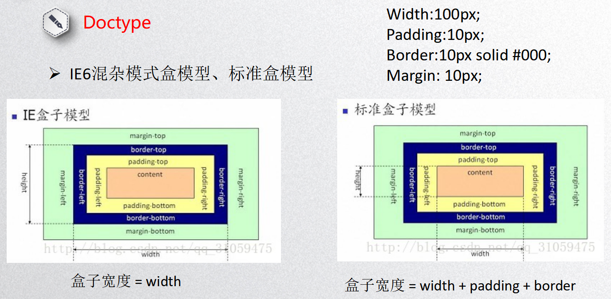
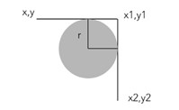
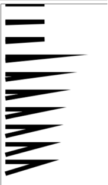
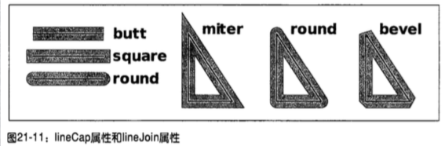
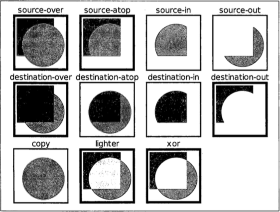
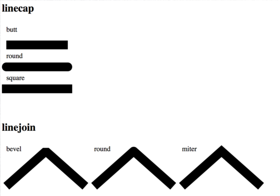
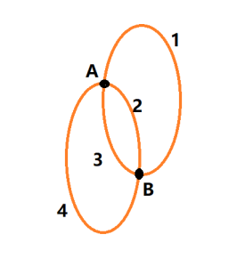
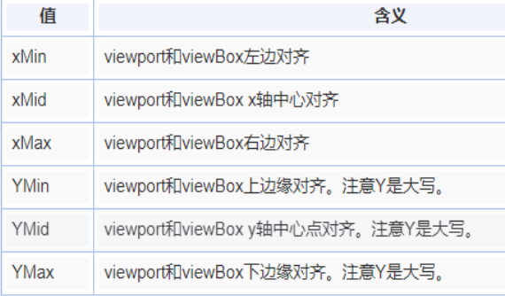
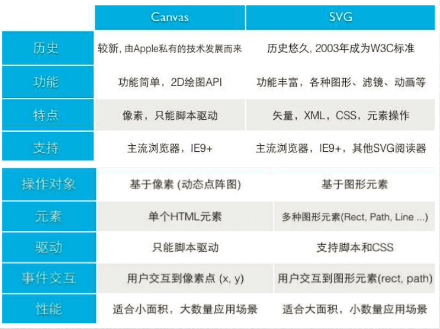

# HTML
## 1. HTML5 新特性

* 新语义元素
* 新的 Input 类型和属性
* 音视频
* 画布
* 拖放
* 文件读取
* 回调函数管理 API
* 地理位置
* 执行脚本多线程 worker
* 本地存储
* webSocket
* HistoryAPI
* 跨文档通信 postMessage




## 2. HTML5 结构元素

* `header` 定义整个页面的头部或某块区域的页眉
* `footer` 定义整个页面的底部或某块区域的页脚
* `main` 定义文档的主要内容
* `nav` 定义导航链接的部分
* `section` 定义页面中的一个内容区域
* `article` 定义一个独立的、完整的相关内容块
* `aside` 定义页面内容之外的内容，它的内容应该与附近的内容相关，可用作文章的侧栏
* `figure` 定义独立的流内容（图形、图表、照片、代码等等）


## 3. HTML5 功能元素

* `video` 视频
* `audio` 音频
* `source` 媒介资源
* `figcaption` 定义 `figure` 元素的标题（了解）
* `canvas` 画布，定义图形
* `progress` 定义任何类型的任务的进度


## 4. HTML5 新的 Input 类型和属性

### 新类型

* `date` 用于应该包含日期的输入字段
* `color` 用于应该包含颜色的输入字段
* `datetime` 允许用户选择日期和时间（有时区）
* `datetime-local` 允许用户选择日期和时间（无时区）
* `email` 用于应该包含电子邮件地址的输入字段
* `month` 允许用户选择月份和年份
* `number` 用于应该包含数字值的输入字段
* `range` 用于应该包含一定范围内的值的输入字段
* `search` 用于搜索字段（搜索字段的表现类似常规文本字段）
* `tel` 用于应该包含电话号码的输入字段
* `time` 允许用户选择时间（无时区）
* `url` 用于应该包含 URL 地址的输入字段
* `week` 允许用户选择周和年


### 新属性

* `multiple` 可上传多个文件
* `placeholder` 提示
* `pattern` 验证 input 类型输入框中内容是否与正则匹配


## 5. audio、video

### 基本使用

```html 
<audio src="song.mp3"></audio>
<video src="video.mp4" poster></video>
```

```js
var audio = new Audio('song.mp3');
var audio = document.createElement('audio')
```


### 浏览器支持情况

`canPlayType()` 方法：`audio.canPlayType()` 返回 probably 或 maybe 支持，返回空不支持


### 方法

`play()` 播放

`pause()` 停止

`load()` 重置媒体元素并重新载入媒体，可中止正在进行的任务或事件


### 属性

`autoplay` 自动播放

`controls` 控件

`loop` 循环播放

```html
<!-- 静音状态下才能自动播放 -->
<video src="video.mp4" controls autoplay muted></video>
```

**preload(none | metadata | auto)：** 是否预加载

* none：不进行预加载
* metadata：部分预加载
* auto：全部预加载

**currentSrc：** 返回资源链接（要资源加载完成才能获取到）

**duration：** 媒体持续时间（总时长，要资源加载完成才能获取到）

可在该事件下获取：`audio.oncanplay = function () {}`

**currentTime：** 返回或设置资源当前时间

**volume：** 音量【0-1】，可读写

**muted：** 静音

**playbackRate：** 读取或设置媒体资源播放的当前速率（大于 1 快放，大于 0 小于 1 慢放，无倒放）

**paused | ended | seeking：** 查询媒体播放状态，返回 true | false

* paused：是否暂停
* ended：是否结束了
* seeking：正在请求某一播放位置的媒体数据

**played | buffered | seekable：** 返回一个 **TimeRanges** 对象

（timeRanges 对象的 length 属性为部分时间段，`end(i)` 返回已播放时间段的结束时间，`start(i)` 返回已播放时间段的开始时间）

* played：标明媒体资源在浏览器中已播放的时间范围
* buffered：确定浏览器已经缓存媒体文件
* seekable：可以对当前媒体资源进行请求


### 事件

**play：** 媒体开始播放时触发

**pause：** 媒体暂停时触发

**ended：** 资源播放结束

**canplay：** 浏览器能够开始播放媒体数据，但是不确定以当前的速率能否顺利的播放完媒体


## 6. Canvas 画布

### 使用

```html
<canvas width="100" height="100"></canvas>
```

```js
var canvas = document.getElementsByTagName('canvas')[0];
var ctx = canvas.getContext('2d');
```

**注意：** Canvas 获取绘画上下文的 API 是 `getContext('2d')`


### 绘制图形

**样式**

`stroke()` 描边

`lineWidth = 20;` 线宽

`strokeStyle = 'red';` 线的颜色

`closePath()` 闭合路径

`fill()` 填充

`fillStyle = 'red';` 填充颜色


**beginPath()**

fill 和 stroke 方法都是作用在当前的所有子路径，若想开辟新的路径，需要使用 `beginPath()` 方法，在绘制新路径之前使用 `beginPath()`


**直线**

`moveTo(x, y)` 画笔挪到 (x, y) 点

`lineTo(x, y)` 画笔划线到 (x, y) 点

**矩形**

```js
rect(x, y, w, h);
strokeRect(x, y, w, h);
fillRect(x, y, w, h);
```

**圆弧**

```js
arc(x, y, r, sAngle, eAngle, c);
// sAngle: 起始点	eAngle: Math.PI 弧度	c: 方向，默认顺时针 false，逆时针 true
```

**曲线：两条切线之间的弧或曲线**

```js
arcTo(x1, y1, x2, y2, r);
```



**二次方、三次方曲线方程**

```js
quadraticCurveTo(cpx, cpy, x, y);
bezierCurveTo(cp1x, cp1y, cp2x, cp2y, x, y);
// cp: 控制点
```


### 设置图像样式

**线样式**

`lineWidth` 线宽

`lineCap: butt|square|round` 线两头样式

`lineJoin: miter|round|bevel` 两线拐角处

`miterLimit` 绘制交点的方式






**渐变**

`createLinearGradient(x1, y1, x2, y2)` 线性渐变

```js
var bg = ctx.createLinearGradient(0, 0, 400, 400);
bg.addColorStop(0, 'red');
bg.addColorStop(0.5, 'orange');
bg.addColorStop(1, 'green');
ctx.fillStyle = bg;
ctx.fillRect(0, 0, 400, 400);
```

`createRadialGradient(x1, y1, r1, x2, y2, r2)` 径向渐变

```js
var bg = ctx.createRadialGradient(200, 200, 50, 200, 200, 100);
bg.addColorStop(0, 'transparent');
bg.addColorStop(0.5, 'orange');
bg.addColorStop(1, 'transparent');
ctx.fillStyle = bg;
ctx.fillRect(0, 0, 400, 400);
```


**绘制图案**

```js
createPattern(img, 'repeat | repeat-x | repeat-y | no-repeat');
// img: 图片、画布、视频元素
```

**注意：** 等资源加载完


### 操作图形

`translate(dx, dy)` 重新映射画布上的 (0, 0) 位置

`scale(sx, sy)`  缩放当前绘图

`rotate(Math.PI)` 旋转当前的绘图

`save()、restore()` 保存当前图像状态的一份拷贝，栈中弹出存储的图形状态并恢复

`setTransform(a, b, c, d, e, f)` 变化矩阵，先重置再变换

参数：水平缩放、水平倾斜、垂直倾斜、垂直缩放、水平移动、垂直移动

`transform(a, b, c, d, e, f)` 在之前的基础上变换

**`clearRect(x, y, dx, dy)`** 擦除当前区域

**`globalCompositeOperation`** 组合图形

```js
ctx.globalCompositeOperation = 'source-over';
```




### 绘制图像

**`drawImage`** 导入图片

* `drawImage(image, x, y)` 在画布上定位图像

* `drawImage(image, x, y, width, height)` 在画布上定位图像并规定图像的宽度和高度

* `drawImage(image, sx, sy, swidth, sheight, x, y, width, height)` 剪切图像并在画布上定位被剪切的部分

`getImageData(x, y, dx, dy)` 同源策略

`createImageData(w, h)` 创建新的空白 ImageData 对象

`putImageData(imgData, x, y)` 将图像数据放回画布上


### 抽取 canvas 为图片

`canvas.toDataURL()` 将 canvas 的内容抽取成一张图片，base64 编码格式

注：同源策略的限制，要开启服务器，在 www 目录下打开

将 canvas 的内容放入 img 元素里


### 模糊问题

1. 位图像素放大会失真，canvas 为位图像素
2. canvas 绘图时，会从两个物理像素的中间位置开始绘制并向两边扩散 0.5 个物理像素。由于不存在 0.5 个像素，两边都去 1 个像素，视觉上就造成了模糊

解决方案：放大再缩小展示


## 7. SVG（不是 HTML5 的内容） 

### 应用场景

1. 图形（脑图）
2. 图标、logo（矢量图）
3. 动效


### 使用

```html
<svg xmlns="http://www.w3.org/2000/svg" version="1.1"></svg>
```

```js
var char = "http://www.w3.org/2000/svg";
var svg = document.createElementNS(char, 'svg');
```

SVG 元素对象一般通过调用 `setAttribute()` 方法来设定属性值


### 基础元素

```html
<!-- html -->
<!-- 直线 -->
<line x1="100" y1="100" x2="200" y2="100"></line>
<!-- 矩形 -->
<rect x="100" y="100" width="100" height="100" rx="20" ry="50"></rect>
<!-- 圆形 -->
<circle cx="100" cy="100" r="50"></circle>
<!-- 椭圆 -->
<ellipse rx="100" ry="50" cx="250" cy="250"></ellipse>
<!-- 多边形 -->
<polygon points="100 100, 70 150, 130 150"></polygon>
<!-- 折线 -->
<polyline points="0 100, 100 35, 200 150, 300 75, 400 150, 500 20"></polyline>
<!-- 字体 -->
<text x="300" y="300">蝉壳</text>
```


### 基础样式

* `fill: transparent;`
* `stroke: red;`
* `stroke-width: 10px;`
* `stroke-opacity|fill-opacity: 0.5;`
* `stroke-linecap: butt|round|square;`
* `stroke-linejoin: bevel|round|miter;`




### 重要元素：路径

**`<path>`** 元素可以定义一个路径，属性说明如下：

```html
<path d="M 100 100 L 400 100"></path>
```

d：定义路径指令

M = moveTo：移动到

L = lineTo：划线到

H = horizontal lineTo：水平线到

V = vertical lineTo：垂直线到

C = curveTo：三次贝塞尔曲线到

S = smooth curveTo：光滑三次贝塞尔曲线到

Q = quadratic Bezier curve：二次贝塞尔曲线到

T = smooth quadratic Bezier curve：光滑二次贝塞尔曲线到

A = elliptical Arc：椭圆弧 A 70 120 0 1 1 150 200

Z = closepath：闭合路径

注：以上所有命令均允许小写，大写表示绝对定位，小写表示相对定位



**路径属性**

* `stroke-dasharray: 100px;` 虚线画一段空一段
* `stroke-dashoffset: 15px;` 缩进，缩进的线段隐藏

注：`getTotalLength` 获取路径长度


**渐变**

* 线性渐变

  ```html
  <defs>
      <linearGradient id="bg1" x1="0" y1="0" x2="0" y2="100%">
          <stop offset="0%" style="stop-color:rgb(255,255,0);"/>
          <stop offset="100%" style="stop-color:rgb(255,0,0);"/>
      </linearGradient>
  </defs>
  <rect x="0" y="0" width="500" height="500"style="fill:url(#bg1)"/>
  ```

* 径向渐变

  ```html
  <defs>
      <radialGradient id="bg2" cx="50%" cy="50%" r="50%" fx="50%" fy="50%">
          <stop offset="0%" style="stop-color:green;"/>
          <stop offset="100%" style="stop-color:red;"/>
      </radialGradient>
  </defs>
  <rect x="0" y="0" width="500" height="500"style="fill:url(#bg2)"/>
  ```

<br/>

**滤镜**

* 高斯滤镜

  ```html
  <defs>
      <filter id="Gaussian_Blur">
          <feGaussianBlur in="SourceGraphic" stdDeviation="20"/>
      </filter>
  </defs>
  <rect x="0" y="0" width="500" height="500" fill=”yellow” style="filter:url(#Gaussian_Blur)"/>
  ```

* 其他滤镜

  http://www.w3school.com.cn/svg/svg_filters_intro.asp

<br/>

**viewbox**

* viewbox 属性

  ```html
  <svg width="400" height="300" viewBox="0,0,40,30" style="border:1px solid #cd0000;">
      <rect x="10" y="5" width="20" height="15" fill="#cd0000"/>
  </svg>
  ```

* preserveAspectRatio（作用的对象都是 viewBox）

  `preserveAspectRatio = "xMidYMid meet"`

  参数 1：viewBox 在 svg 中对齐方式

  

  参数 2：高宽比

  meet：保持纵横比缩放 viewBox 适应 viewport

  slice：保持纵横比同时比例小的方向放大填满 viewport（在均匀缩放的同时保持 viewbox 的宽高比）

  none：不保持自己的宽高，扭曲纵横比以充分适应 viewport


**SVG 动画**

```html
<animate attributeName="opacity" from="0" to="1" begin="0s" dur="0.6s" repeatCount="indefinite"/>
<animate attributeName="height" values="20;10;20" begin="0.4s" dur="0.6s" repeatCount="indefinite"/>
```

<br/>

**Canvas VS SVG**




## 8. Drag 和 Drop 拖放

### 拖放 API 基础

拖放元素上属性需加上 `draggable="true"`

**绑定在被拖放元素上**

* **`dragstart`** 开始被拖拽时触发
* `drag` 在拖拽的过程中触发
* `dragend` 拖拽完成时触发

**绑定在目标元素上**

* `dragenter` 拖放元素进入目标元素时触发
* **`dragover`** 拖放元素在目标元素上时触发
* `dragleave` 拖放元素在目标元素上离开时触发
* **`drop`** 被拖放的元素在目标元素上同时鼠标放开时触发

**注**：需要阻止 `dragover` 的默认行为才会触发 `drop` 事件，`e.preventDefault()`


### dataTransfer 对象

* `getData()` 向 `dataTransfer` 对象中读取数据
* `setData()` 向 `dataTransfer` 对象中存放数据


## 9. 文件操作

### fileList and file

* `fileList` 表示用户选择的文件列表
* `file` 表示 file 控件内的每一个被选择的文件对象，fileList 为这些 file 对象的列表


### FileReader 对象

负责把文件读入内存，并且读取文件中的数据

**读取并显示文件**

`readAsText()` 将文件中的数据读取为文本数据

`readAsBinaryString()` 读取为二进制字符串

`readAsDataURL()` 读取为 DataURL 字符串

`readAsArrayBuffer()` 读取为一个 ArrayBuffer 对象

`abort()` 中断读取操作


**检测读取事件**

`onabort` 数据读取中断时触发

`onprogress` 数据读取中触发

`onerror` 数据读取出错时触发

`onload` 数据读取完成时触发

`onloadstart` 数据开始读取时触发

`onloadend` 数据读取完成时触发，无论成功还是失败


### Blob 对象

* blob 对象的访问
* blob 对象的创建
* 截取 blob 对象 `blob.slice(start, end)`


## 10. 优化 web 动画

### 计时器做动画存在的问题：

1. 当前窗口不在动画页面时，计时器仍将继续工作
2. 回调函数执行耗时，导致排队
3. 设置动画频率高，导致过度绘制，出现掉帧

**浏览器屏幕刷新频率：** 1000/60 = **16.7ms**


### requestAnimationFrame 优势：

1. 当前窗口不在动画页面时，停止工作
2. 浏览器刷新屏幕时自动执行，无需设置时间间隔
3. 浏览器优化


### requestAnimationFrame 使用：

1. `req = requestAnimationFrame(cb);` 屏幕每次绘制时执行回调函数 cb
2. `cancelAnimationFrame(req)` 停掉


## 11. Geolocation 地理位置信息

**Geolocation API**

`navigator.geolocation` 对象返回经纬坐标等元数据信息

**获取当前地理位置**

`navigator.geolocation.getCurrentPosition(suc, err, obj);`

参数 1：suc 成功回调，有参数 option，属性如下：

* `accuracy` 经纬度的精度
* `altitude: null` 海拔
* `altitudeAccuracy: null` 海拔的精度
* `heading: null` 设备前进方向
* `latitude: 35.54646` 纬度
* `longitude: 118.546456` 经度
* `speed: null` 设备前进速度
* `timestamp` 获取地理位置信息的时间

参数 2：err 失败回调，有参数 error 对象，属性如下：

* code 属性：
  * 1：用户拒绝了位置信息
  * 2：获取不到位置信息
  * 3：获取信息超时 

* message 属性：错误信息字符串

参数 3：obj 可选参数

* enableHighAccuracy：是否要求高精度的地理位置信息
* timeout：超时限制
* maximumAge：缓存有效时间，若为 0 则无条件重新获取新地理位置信息


**监视地理信息**

```js
var id = navigator.geolocation.watchPosition(suc, err, obj);
```

持续定期的自动获取用户的当前地理位置信息，并同计时器一样有个位置标识


**停止获取位置信息**

```js
navigator.geolocation.clearWatch(id);
```


## 12. Worker 多线程处理

### 使用场景

大型数据运算、计时器、异步请求、访问 navigator 部分属性、js 核心对象


### 使用 worker

```js
//主进程文件
var worker = new Worker('worker.js');
worker.postMessage(10);
worker.onmessage = function (e) {
    console.log(e.data);
}

//worker文件
onmessage = function (e) {
    var num = e.data;
    postMessage(num * 100);
}
```


### 结束 worker

* `close()` 在 worker 文件中使用
* `terminate()` 在 worker 对象上调用 `worker.terminate()`


### 局限性

* 不能跨域加载
* worker 文件不能访问 DOM

