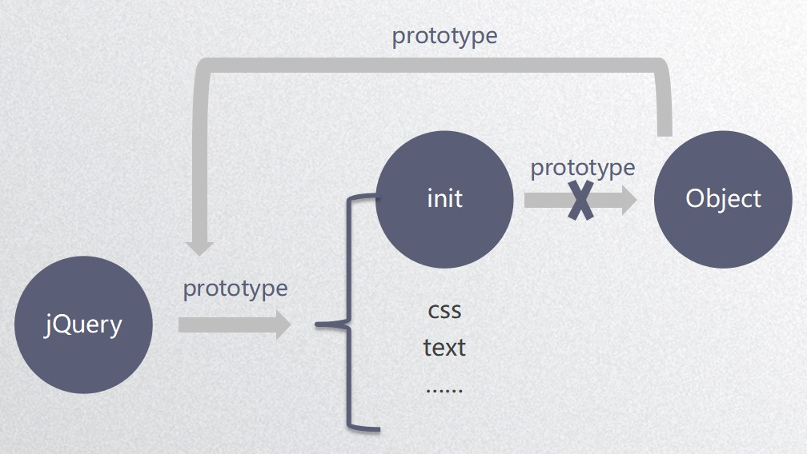
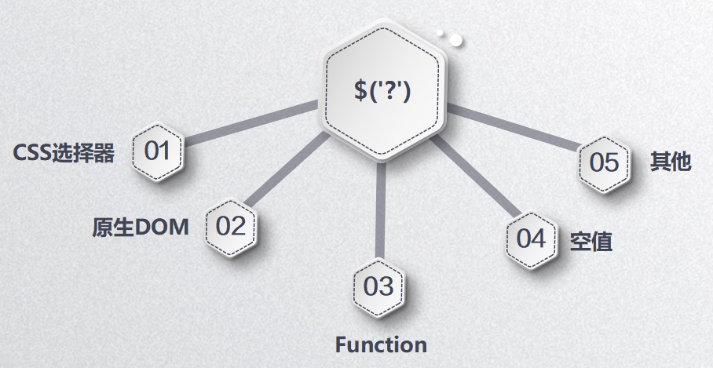

# jQuery


## 1. jQuery 简介

jQuery 是一个高效、精简并且功能丰富的 JavaScript 工具库

**jQuery 特色：**

1. 语法简单、开发高效
2. 文件够轻、短小精悍
3. 插件丰富、拓展性强
4. 浏览器支持高


## 2. 整体框架封装

```js
(function () {
    //全局使用jQuery
    window.jQuery = window.$ = jQuery;

    function jQuery(id) {
        //无new操作
        return new init(id);
    }

    function init(id) {
        var dom = document.getElementById(id.slice(1));
        this[0] = dom;
        this.length = 1;
        return this;
    }

    jQuery.prototype.text = function () {
        console.log('text');
        return this;     //链式操作
    }
    jQuery.prototype.css = function () {
        console.log('css');
        return this;    //链式操作
    }

    init.prototype = jQuery.prototype;    //init原型由原来的Object变成指向jQuery原型
})();
```




**jQuery selector**




## 3. 属性

### 文本属性

`text()` 取值赋值均一组，可以添加字符串、函数

`html()` 取值取第一个，赋值赋一组，可以添加字符串、函数

`val()` 取值取第一个，赋值赋一组，可以添加字符串、函数、数组

例子：

```js
$('div').html(function (index, ele) {});	// index: 索引   ele: 元素的值
```


### 特性、属性

属性：

1. 固有属性（特性）：`id`，`class`， `title`，`href`，`src`，`alt`，`type`，`value` ...
2. 新增属性：自定义的属性

`attr()`，`prop()` 取值取第一个，赋值赋一组，`prop()` 只对特性生效、对自定义属性无效

attr 获取未设置的属性均返回 undefined，prop 获取未设置的特性返回空

`removeAttr()`，`removeProp()`

`removeProp()` 只能删除通过 `prop()` 设置的自定义属性


### class 属性操作

`addClass` 添加

`removeClass` 删除

`hasClass` 是否有 class，有返回 true，没有返回 false

`toggleClass` 自动判断是否有 class，有就删除，没有就添加上

```js
// 以下三种写法效果一样

$('.item').click(function () {
    if ($(this).attr('class') == 'item active') {
        $(this).removeClass('active');
    }else {
        $(this).addClass('active');
    }           
})

$('.item').click(function () {
    if ($(this).hasClass('active')) {
        $(this).removeClass('active');
    }else {
        $(this).addClass('active');
    }
})

$('.item').click(function () {
    $(this).toggleClass('active');
})

```


### CSS 样式属性

获取值：单个值 css(string) | 多个值 css([ ])

设置值：单个值 css(string, value) | 多个值 css({ })

`css('width')` 'string'

`width()` number content

`innerWidth()` content + padding

`outerWidth()` content + padding + border

`outerWidth(true)` content + padding + border + margin

`offset()` 相对于文档而言的位置

`position()` 相对于最近的有定位的父级的位置，不能被设置、不能传参数

`scrollTop()`

`scrollLeft()`


## 4. DOM

### DOM 的筛选遍历

`each()` 遍历

**筛选**

* `odd` 索引为奇数
* `even` 索引为偶数
* `eq(n)` 索引第 n 位
* `first()` 第一个
* `last()` 最后一个
* `prev()` 前一个兄弟元素
* `prevAll()` 前面所有兄弟元素
* `next()` 后一个兄弟元素
* `nextAll()` 后面所有兄弟元素
* `siblings()` 所有兄弟元素
* `filter('.test')` 有 test 的要
* `not('.test')` 有 test 的不要
* `is('.test')` 是否有 test，有返回 true，没有返回 false
* `slice(2, 4)` 找索引为 2、3 的元素
* `map` 遍历 DOM 元素筛选
* `has` 找子元素有什么元素的父元素


**查找**

`parent(selector)` 直接父元素

`parents(selector)` 祖先元素

`closest(selector|jQuery Object|element)` 最近的 selector 元素

`offsetParent()` 找离它最近的有定位的父级

`children(selector)` 子元素

`find()` 后代元素

`end()` prevObject 回退

`add(selector|element|jQuery Object|html)` 添加

`addBack()` 把前一个也添加进去


### DOM 插入操作

`before()`，`insertBefore()`

```js
// h2插入到li前面
$('li').before($('h2'));
$('h2').insertBefore($('li'));
```

`after()`，`insertAfter()`

```js
// h2插入到li后面
$('li').after($('h2'));
$('h2').insertAfter($('li'));
```

`append()`，`appendTo()` 插入到所有子元素最后面

`prepend()`，`prependTo()` 插入到所有子元素最前面


### DOM 操作

**替换**

`$('.three').replaceAll($('.two'))` 被替换的元素写后面

`replaceWith()` 被替换的元素写前面

**删除**

`$('ul').empty()` 删除所有子元素

`remove()` 删除当前元素后只返回 DOM 元素

`detach()` 删除当前元素后返回 DOM 元素和绑定在 DOM 元素上的事件

**克隆**

`clone()` 浅克隆，只克隆 DOM 元素

`clone(true)` 深度克隆，DOM 元素和绑定在 DOM 上的事件一起克隆

**包裹**（了解即可）

`wrap()` 在外面包裹一层

`wrapAll()` 会破坏 DOM 的结构

`wrapInner()` 在里面包裹一层

`unwrap()` 删除包裹


## 5. 事件

**鼠标事件**

`click`，`dblclick` 双击，`contextmenu` 右键事件，`event.which` 1 左键|2 滚轮|3 右键

`mouseenter` 进入，`mouseleave` 离开 —— **不会冒泡**

`mouseover` 进入，`mouseout` 离开 —— **会冒泡**

`mousedown` 按下，`mousemove` 移动，`mouseup` 抬起


**焦点、滚轮、取消默认等事件**

`focus` 获取焦点，`blur` 失去焦点，`change` 发生变化

`keydown` 返回键值代码，`keypress` 返回 ASCII 编码字符，`keyup`

`scroll`

`event.pageX`，`event.pageY` 获取当前鼠标距离窗口的 left 和 top 距离

`event.preventDefault` 取消默认事件，`event.stopPropagation` 阻止冒泡


**事件高级使用及事件委托**

`on()` 绑定事件，`one()` 绑定只执行一次的事件

`off()` 删除事件，`trigger()` 触发事件

```js
$('ul').on('click', 'li', function () {})    // on() 绑定事件
$('button').one('click', function () {})    // one() 绑定只执行一次的事件
$('button').off('click')    // off() 删除事件

$('button').click(function () {
    $('p').trigger('color');    // trigger() 触发
})
```


## 6. 动画

**隐藏与显示动画**

`hide()` 突然隐藏，`show()` 突然显示

`slideDown()` 向下展示出来，`slideUp()` 向上隐藏，`slideToggle()` 如果是隐藏的点一下显示，如果是显示的点一下隐藏，( ) 里面可以传时间和函数

`fadeToggle` 透明度为 0 时点一下从 0-1，为 1 时从 1-0，`fadeIn()` 透明度从 0-1，`fadeOut()` 透明度从 1-0

**自定义动画**

`animate({过渡属性}, 运动时间, 速率, 回调函数)`

`stop(false, false)` ( ) 里不填默认两个参数都是 false，第一个参数为是否取消动画队列，第二个参数为是否立即完成当前动画


## 7.  常用工具方法

`$.type()` 判断数据类型

`$.trim()` 清除字符串前后两端空格

`$.makeArray()` 类数组转换为数组

`$.inArray()` 判断数组里是否有某个值

`$.each()` 循环遍历

`$.merge()` 合并数组类数组

`$.noConflict()` $ 权限移交出去

`$.data()` 获取在 DOM 中缓存的数据 `<div class="wrapper" data-name="aimee"></div>`


## 8. 高级方法

**extend 合并对象**

`$.extend()` 工具方法，创建在 jQuery 上

```js
$.extend(obj, people1, people2);  //浅克隆
$.extend(true, obj, people1, people2);    //深克隆
```

`$.fn.extend()` 实例方法，创建在 jQuery 原型上

<br>

**Callbacks 处理多个回调函数**

`fire()` 触发

`$.Callbacks()` 括号里可以传下面 4 个参数：

* once，只能 fire 一次
* memory，fire 后 add 的回调函数自执行
* unique，去重
* stopOnFalse，遇到 false 停止

<br>

**$.Deferred() 延迟对象**

`resolve()` 成功状态

`reject()` 失败状态

`notify()` 进行中

`done()` 监听成功

`fail()` 监听失败

`progress()` 监听进行中