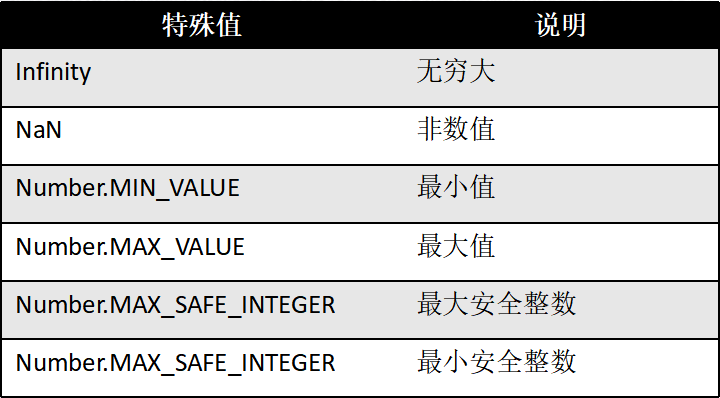
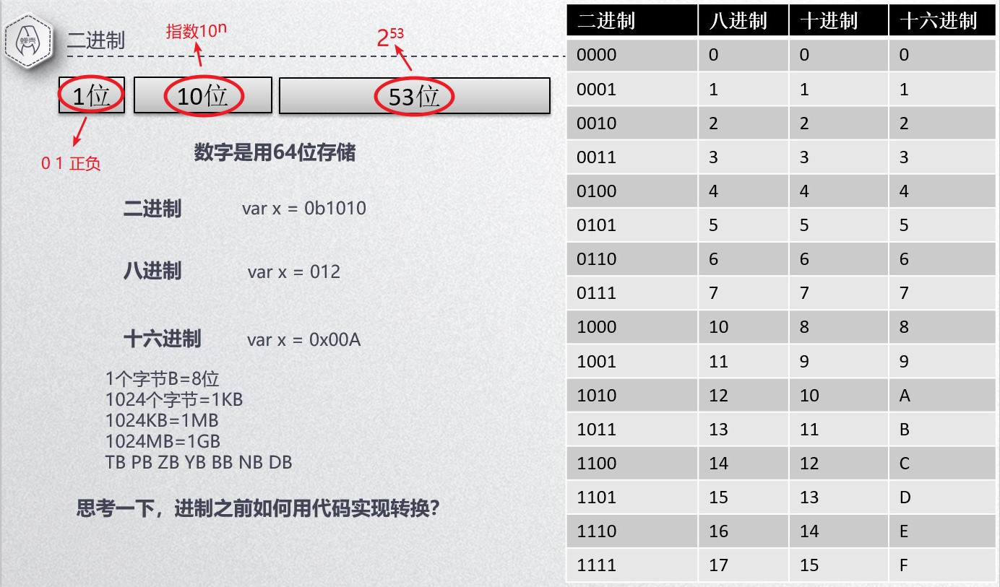
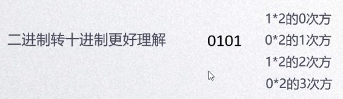
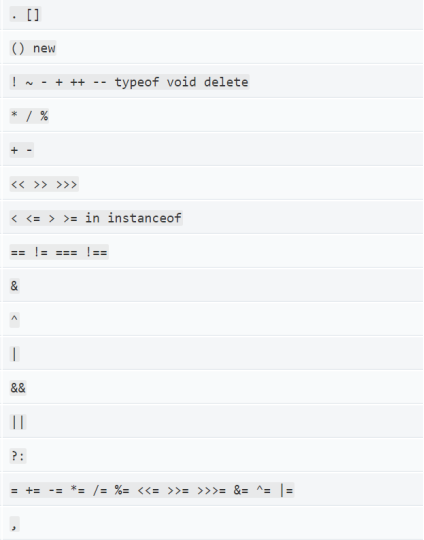

# JavaScript

## 1、延迟加载

**定义：** 表示脚本可以延迟到文档完全被解析和显示后再执行。

**defer**

```html
<script defer src="1.js"></script>
<script defer="defer" src="1.js"></script>	<!-- XHTML的写法 -->
```

**加载模式**

1. 并发
2. 多个 js，按定义的顺序执行
3. 在 HTML 文档解析完才执行
4. 在 DOMContentLoaded 事件之前执行完
5. 只支持外部引入方式（IE7之前的除外）


## 2、异步加载

**定义：** 表示应该立即下载脚本，但不应妨碍页面中的其他操作。

**async**

```html
<script async src="1.js"></script>
<script async="async" src="1.js"></script>	<!-- XHTML的写法 -->
```

**加载模式**

1. 并发
2. 多个 js，不一定按顺序执行
3. js 加载完就执行，在 load 事件之前
4. 在 load 事件之前执行完
5. 只支持外部引入方式


## 3、JS数据类型及获取类型

**6 种基本类型：** number	string	boolean	null	undefined	object

**获取数据类型常用的 4 种方法：**

1. `typeof` 无法判断对象的具体类型
2. `Object.prototype.toString.call()` 仅能判断系统自带类型，对自定义对象无效
3. `instanceof` 仅能判断对象的具体类型
4. `constructor` 查看对象对应的构造函数

**判断自定义变量的方法：**

```js
function fn(cc) {
    var typename = Object.prototype.toString.call(cc);
    if (typename === '[object Object]') {
        typename = '[object ' + cc.constructor.name + ']';
    }
    return typename;
}
```


## 4、数字和二进制

int  100

float  1.111

科学计数法  1e+3  =>  1000





<br>

**十进制转二进制**



**正整数**				除 2 取余排序，倒序

**小数** 				   乘 2 取整，正序

**小于 1 的小数**	  拆成整数和小数部分分别计算

**负整数** 			   在正整数基础上，取反并+1

```js
// 正整数
function fn(num) {
    var ary = [];
    while (num) {
        ary.push(num % 2);
        num = parseInt(num / 2);
    }
    ary.reverse();
    var s = ary.join('');
    console.log(s);
}
```

转换进制方法`num.toString('n')` 转二进制 n = 2，八进制 n = 8


## 5、字符串

**组成：** 单或双引号包裹的 Unicode 字符、数字、各种符号

**注意：** 

1. 在一行内
2. 单双引号要成对
3. 字符串中每个字符都有自己的下标位置，从 0 开始
4. 特殊字符要用转义字符表示：换行、引号

**转义字符：** 改变字符本来的意义

\n 换行	\r 回车	


## 6、运算符

**运算规则：**

1. 先完成优先级高的运算符
2. 同一优先级的从左往右

**优先级简单记忆：** 操作的元素越多，优先级越低，赋值运算最低

`void` 表明一个运算没有返回值




## 7、内存管理之栈和堆

**内存分配**

栈：系统自动分配，物理内存连续

堆：动态创建，物理地址不连续，程序自行维护


## 8、函数

**创建方法**

* 静态方法：

```js
function add(a, b) {
    return a + b;
}
var add = function (a, b) {
    return a + b;
}
```

* 动态方法：

```js
var add = new Function('a', 'b', 'return a + b;');
```

<br>

**函数分为定义和使用两阶段**

`return` 终止函数的执行，并返回一个指定的值给函数调用者。

<br>

**作用域**

函数可以嵌套

```js
function add1() {
    function add2() {
        alert('111');
    }
    add2();
}
add1();
```

```js
var x = 1;
function fn() {
    var x = 2;
    function e1() {
        return x;	// 访问的是局部变量
    }
    var e2 = new Function('return x;');		// 访问的是全局变量
    return [e1(), e2()];
}
// e1()  =>  2		e2()  =>  1
```

<br>

**参数及 arguments**

```js
function add(a, b) {
    return a + b;
}
var x = 1;
var y = 2;
add(x, y);	// a b => 形参，x y => 实参
```

**arguments：** 仅在函数里面有，专为函数参数设计的对象，是伪数组 length 下标 []，用`Array.prototype.slice.call(arguments)`转成数组。

**callee：** 指向函数自己，`arguments.callee`  获取函数

<br>

**函数的三大特性**

- **方法特性 ( )** 	&nbsp;&nbsp;&nbsp;&nbsp;&nbsp;&nbsp;&nbsp;&nbsp;&nbsp;运行大括号包裹的代码
- **对象特性  .**   &nbsp;&nbsp;&nbsp;&nbsp;&nbsp;&nbsp;&nbsp;&nbsp;&nbsp;&nbsp;&nbsp;&nbsp;获取对象的属性
- **类的特性 new**  &nbsp;&nbsp;&nbsp;&nbsp;&nbsp;&nbsp;创建类似的对象

<br>

**函数的 call、apply**

**定义：** 把函数临时赋值到对象上面并执行。

**call：** `function.call(obj, args1, args2)`

**apply：** `function.apply(obj, args)`

**两者区别：** 传递参数的形式不一样，apply 参数是数组，第一个参数都是 object

<br>

**函数的 bind**

**定义：** 把函数拷贝一份，并插入到对象作用域上面。

**语法：** `obj.e = function.bind(obj, args1, args2)`

<br>

**函数 this 指针**

**定义：** this 是函数体内自带的一个对象指针。

- `this` 总是指向函数的直接调用者
- 如果有`new`关键字，`this`指向`new`出来的那个对象
- 在事件中，`this`指向触发这个事件的对象


## 9、递归函数

**递归：** 函数自己调用自己，需要有终止条件。

**递归思维：** 把复杂的问题，拆成越来越简单的问题，直到能够获得结果。


## 10、闭包

**三要素：**

1. 嵌套结构的函数
2. 内部函数访问外部函数的变量
3. 在外部函数的外面调用内部函数

**概念：** 闭包是由函数以及创建该函数的词法环境组合成的，这个环境包含了这个闭包创建时所能访问的所有局部变量。

**简易类特性：闭包工厂（函数） => 闭包对象**

闭包工厂每运行一次创建一个新的闭包对象

**闭包函数：** 

```js
function fn() {
    var a = 1;
    function e() {
        a++;
    }
    return e;
}
```

**作用：**

1. 让局部变量变成私有化的长存变量
2. 给事件调用函数传递参数

**常见错误：** 循环内使用闭包函数

**解决方法：** 

1. 使用立即执行函数

```js
function showID(id) {
    console.log('li:' + id);
}

function setClick() {
    var ary = document.getElementsByTagName('li');
    for (var i = 0; i < 5; i++) {
        (function () {
            var id = i;
            ary[id].onclick = function () {
		       showID(id + 1);	
            };
        })();
    }
}

setClick();
```

2. 使用多个闭包函数

```js
function showID(id) {
    console.log('li:' + id);
}

function clickMake(id) {
    return function () {
        showID(id);
    }
}

function setClick() {
    var ary = document.getElementsByTagName('li');
    for (var i = 0; i < 5; i++) {
        ary[i].onclick = clickMake(i + 1);
    }
}

setClick();
```


## 11、对象

 **什么是对象：** 存在内存中，可以具有多个属性的数据

如何复制一个对象，用枚举法

```js
var obj2 = {};
for (var i in obj1) {
    obj2[i] = obj1[i];
}
```

**注意：** 只能复制可枚举的属性

**对象销毁机制：** 无引用后定期自动回收


## 12、对象、构造函数、原型的关系

**对象创建方式：**

- **直接量&nbsp;&nbsp;&nbsp;&nbsp;&nbsp;&nbsp;&nbsp;&nbsp;&nbsp;**  `var a1 = {};`
- **构造函数&nbsp;&nbsp;&nbsp;&nbsp;&nbsp;&nbsp;**  `var a1 = new Object();`
- **create方法&nbsp;&nbsp;&nbsp;**  `var a1 = Object.create(原型对象, 属性列表);`

**创建原理：** 基于构造函数定义的属性，并继承原型对象的属性，生成一个新的对象。

**类：** 构造函数

**原型：** 特殊的对象，类的 `prototype` 进行设置


## 13、原型、原型链、继承

**原型对象：** 原型属性	公共属性

**当前对象：** 本地属性	私有属性

本地属性被修改，只有当前对象的该属性被修改。

原型属性被修改，所有对象的该属性被修改。

**原型链：** 对象A（原型B）=> 对象B（原型C）=> 对象C（原型D）

**继承原则：** 

1. 本地有的用本地
2. 本地没有的找原型
3. 原型没有的找原型对象的原型

**实用方法：** 

获得原型：`Object.getPrototypeOf(obj)`

构造函数检测原型：`constructor.isPrototypeOf(obj)`

**for in**  =>  可枚举属性，包括原型的

检测私有属性：`obj.hasOwnProperty(name)`

`Object.getOwnPropertyNames()`  所有私有属性的名称

`Object.keys()` 可枚举的私有属性的名称


## 14、对象属性的高级用法

获取属性值用 `.` ，多层级的，就用多个 `.`

**属性的特性：**

1. 可写			是否可设置该属性的值			              `writable: true`
2. 可枚举        for/in 是否可以获得该值                       `enumerable: true`
3. 可配置        是否可以删除或修改该属性特性           `configurable: true`

**定义属性的特性：**

`Object.defineProperty(对象, 属性名字符串, 特性描述对象)`

`Object.defineProperties(对象, 多属性特性描述对象)`

**查看属性的特性：**

`Object.getOwnPropertyDescriptor(对象, 属性名)`  => 私有属性的特性描述


## 15、对象特性及克隆

| 函数                     | 不可添加新属性 | 不可设置特性 | 不可修改属性值 |
| ------------------------ | -------------- | ------------ | -------------- |
| Object.preventExtensions | 是             | 否           | 否             |
| Object.seal              | 是             | 是           | 否             |
| Object.freeze            | 是             | 是           | 是             |

**作用：** 保护对象的属性

**查看特性的方式：** 

`Object.isExtensible`

`Object.isSealed`

`Object.isFrozen`

**克隆对象：** 

- 深克隆：

  ```js
  function clone(obj) {
      var obj1 = {};
      for (var i in obj) {
          if (typeof obj[i] == 'object') {
              obj1[i] = clone(obj[i]);
          } else {
              obj1[i] = obj[i];
          }
      }
      return obj1;
  }
  ```

- 原型克隆：

  ```js
  var obj1 = {};
  function clone(obj) {
      function Temp() {};
      Temp.prototype = obj;
      return new Temp();
  }
  ```

<br>

**对象的深度克隆：**

```js
function clone(obj) {
    // 数组
    if (obj instanceof Array) {
		var ary = [];
        for (var i = 0; i < obj.length; i++) {
            ary[i] = clone(obj[i]);
        }
        return ary;
    }
    // 对象
    if (obj instanceof Object) {
		var newObj = {};
        for (key in obj) {
            newObj[key] = clone(obj[key]);
        }
        return newObj;
    }
    return obj;
}
```


## 16、数组详解

**定义：** 数组是一种有序数据结合，具有 length 属性	元素	API

注意：数组的值是有序的，对象的值是无序的。

**创建方式：** 

1. 直接量						`var a = [];`			推荐使用
2. 构造函数                    `var a =  new Array()`           多个值或一个非数值

**如何遍历数值：** `for` 或 `for in`

**注意：** 

1. 数组长度是弹性的。
2. 下标从 0 开始的非负整数，且小于 2<sup>23</sup>-1。
3. 下标不符合，将转换为字符串，成为对象属性           关联数组


## 17、数组API

**数组常用操作：**

- `push` 将一个或多个元素添加到数组的末尾，并返回该数组的新长度
- `pop` 从数组中删除最后一个元素，并返回该元素的值
- `unshift` 将一个或多个元素添加到数组的开头，并返回该数组的新长度
- `shift` 从数组中删除第一个元素，并返回该元素的值 
- `concat` 合并两个或多个数组，不会更改现有数组，而是返回一个新数组
- `splice` 通过删除或替换现有元素或者原地添加新的元素来修改数组，并以数组形式返回被修改的内容 `arr.splice(1, 3, '1', '2')` (开始删除元素的下标，删除的个数，添加的元素)
- `slice` 截取数组中一段元素生成一个新数组 `arr.slice(开始下标, 结束下标)` 不包括结束下标 
- `reverse` 将数组中元素的位置颠倒，并返回该数组
- `sort` 对数组的元素进行排序，并返回数组。默认排序顺序是将元素转换成字符串进行升序排列
- `indexOf` 返回指定元素在数组中的第一个索引，如果不存在，则返回-1
- `lastIndexOf` 返回指定元素在数组中的最后一个索引，如果不存在，则返回-1
- `forEach` 对数组中的每一项运行给定函数，这个方法没有返回值
- `every` 对数组中的每一项运行给定函数，如果该函数对每一项都返回 true，则返回 true
- `some` 对数组中的每一项运行给定函数，如果该函数对任一项返回 true，则返回 true
- `map` 对数组中的每一项运行给定函数，返回每次函数调用的结果组成的数组
- `filter` 对数组中的每一项运行给定函数，返回该函数会返回 true 的项组成的数组
- `reduce` 从数组的第一项开始迭代数组的所有项，然后构建一个最终的返回值
- `reduceRigth` 从数组的最后一项开始迭代数组的所有项，然后构建一个最终的返回值   

 

## 18、常见字符串处理需求

**字符串定义：** 双引号	单引号	转义字符

**理解 Unicode 编码：** 

Unicode 编码是一本字典书，现在写了17页了

每一页：两个字节来存储 0x0000 - 0xFFFF

早期 ASCII 码：0x00 -0xFF	256个英文及常用符号  =>  0x0000 - 0x00FF  英文及常用符号

- 字符和编码之间转化			`fromCharCode` 编码转成字符		`charCodeAt` 字符转成编码
- 字符串长度和字节长度        单字节 和 双字节
- 字符串拼接                           `+` (建议)         `concat`
- 字符串查找                           `charAt`   `indexOf`  `lastIndexOf`  `match`   `search`  注意正则的使用
- 字符串截取                           `slice` 和 `substring`
- 字符串替换                           `replace`
- 字符串和数组之间转化        `join` (数组转字符串)        `split`  (字符串转数组)   
- URL编码                                `encodeURI`


## 19、正则表达式语法

**意义：**

- 描述字符模式的对象		字符组成的特殊格式的字符串
- 普通字符`'a1'`                  正则：`/a[0-9]/` 

**定义：**

- 直接量			`/字符模式/标志字符`
- RegExp类       `new RegExp('字符模式', '标志字符')`   `g`：全局匹配     `i`：不区分大小写    `m`：多行匹配
- 组成                普通字符`A-Za-z0-9+-*/(){}*?=^$` 等等 及 元字符 

**字符模式：**

- 字符范围		`[abc]`  `[0-9]`  `[^abc]`
- 逻辑或 `|`       `/(abc) | (123)/`
- 重复               `+`：至少一个，  `*`：0 个或多个，   `?`：0 个或 1 个，   `{x}`：x 个，   `{x,y}`：x - y 个，    `{x,}`：至少 x 个
- 重复               默认贪婪模式    加上 `?` 变懒惰模式
- 限定词           以什么开头最前面写上 `^`    以什么结尾末尾写上 `$`
- 声明量词       `(?=as)` `(?!as)`
- 表达式分组及引用


## 20、正则实战

**作用：**

* 验证字符串
* 查找字符串
* 截取字符串
* 替换字符串

**RegExp：**

- **exec**	    检索指定值，返回数组
- **test**         检索指定值，返回 true 或 false

**String：**

- **search**		检索指定值，返回下标
- **match**        检索指定值，返回数组
- **replace**      替换指定值，返回数组
- **split**            分割字符串，返回数组		


**提取任意网址所有的参数：**

```js
var url = 'https://www.baidu.com/s?&wd=%E8%A2%81%E5%86%B0%E5%A6%8D&oq=%25E5%25B0%2586%25E5%25A4%259C2&rsv_pq=fa4c460d000363d1&rsv_t=7217Czdyn26tlt%2B24ylBsXSUPdqlcLPgIejwwPB1DpBOIUakDhgIoCzMEew&rqlang=cn&rsv_enter=1&inputT=18299&rsv_sug3=31&rsv_sug1=36&rsv_sug7=101&bs=%E5%B0%86%E5%A4%9C2';
var reg = /(\w+)=([A-Za-z0-9_%]+)/gi;
var param = {};
url.replace(reg, function (a, b, c) {
	param[b] = c; 
});
```


## 21. JS 加载时间线

1. 创建 Document 对象，开始解析 web 页面，解析 HTML 元素和它们的文本内容后添加 Element 对象和 Text 节点到文档中。这个阶段 `Document.readyState = "loading"`。
2. 遇到 link 外部 css，创建线程加载，并继续解析文档。
3. 遇到 script 外部 js，并且没有设置 async|defer，浏览器加载并阻塞，等待 js 加载完成并执行该脚本，然后继续解析文档。
4. 遇到 script 外部 js，并且设置有 async|defer，浏览器创建线程加载，并继续解析文档，对于 async 属性的脚本，脚本加载完成后立即执行。
5. 遇到 img 标签等，先正常解析 dom 结构，然后浏览器异步加载 src，并继续解析文档。
6. 当文档解析完成，`document.readyState = "interactive"`。
7. 文档解析完成后，所有设置有 defer 的脚本会按照顺序执行。
8. 当文档解析完成之后，document 对象触发 DOMContentLoaded 事件，这也标志着程序执行从同步脚本执行阶段，转化为事件驱动阶段。
9. 当所有 async 的脚本加载完成并执行后，img 等加载完成后，`document.readyState = "complete"`，window 对象触发 load 事件。
10. 从此，页面以异步响应方式处理用户输入，网络事件等。

