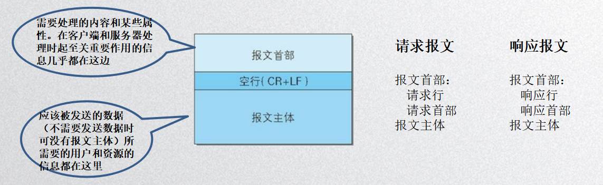
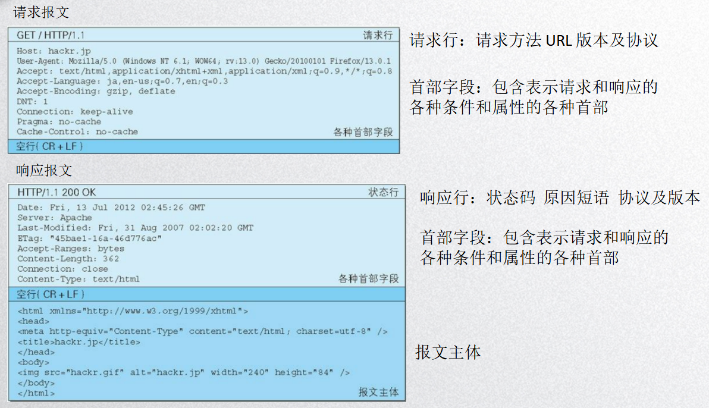
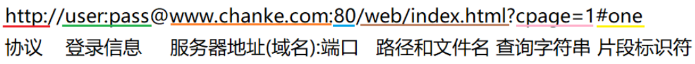

# 网络

## 1. 手动封装 Ajax 兼容性写法

### 什么是 Ajax？

ajax（Asynchronous JavaScript and XML 异步的 JavaScript 和 XML）

可实现异步、局部的获取数据

XML and JSON

（1）JSON

```js
var data = {"name": "aimee", "age": 18};	// 必须用双引号
JSON.parse(data);	// JSON 格式字符串转 JSON
JSON.stringify(data);	// JSON 转 JSON 格式字符串
```

（2）XML

```xml
<name>aimee</name>
<age>18</age>
```


### 封装 Ajax

1. 创建 ajax 对象
2. 初始化 HTTP 请求参数（请求方式，地址，同步|异步）
3. 发送请求
4. 监控数据
5. 检查数据 使用


**readyState 五种状态**

0 —（未初始化）还没有调用 `send()` 方法

1 —（载入）已调用 `send()` 方法，正在发送请求

2 —（载入完成）`send()` 方法执行完成，已经接收到全部响应内容

3 —（交互）正在解析响应内容

4 —（完成）响应内容解析完成，可以在客户端调用了


**HTTP 状态码 status**

100：信息类，表示 web 浏览器请求，正在进一步的处理中

200：成功，表示用户请求被正确接收正在进一步的处理中 200 OK

300：表示请求没有成功，客户端必须采取进一步的动作

400：客户端错误，表示客户端提交的请求有错误，例如：404 Not Found，意味着请求中所引用的文档不存在 

500： 服务器错误，表示服务器不能完成对请求的处理，如：500


### 使用 Ajax，完成 GET/POST 请求

```js
function ajax(method, url, callback, data, flag) {
    var xhr = null;
    if (window.XMLHttpRequest) {
        xhr = new XMLHttpRequest();
    } else {	
        // 兼容IE6及以下浏览器
        xhr = new ActiveXObject('Microsoft.XMLHttp');
    }

    method = method.toUpperCase();
    if (method === 'GET') {
        var date = new Date();
        timer = date.getTime();
        xhr.open(method, url + '?' + data + '&timer=' + timer, flag);
        xhr.send();
    } else if (method == 'POST') {
        xhr.open(method, url, flag);
        xhr.setRequestHeader('Content-Type', 'application/x-www-form-urlencoded');
        xhr.send(data);
    }

    xhr.onreadystatechange = function () {
        if (xhr.readyState == 4) {
            if (xhr.status == 200) {
                callback(xhr.responseText);
            }
        }
    }
}
```


## 2. HTTP 协议那些事

### HTTP 协议是什么？

超文本传输协议（HTTP，HyperText Transfer Protocol）是用于从 web 服务器传输超文本到 web 浏览器的传输协议。所有的 www 文件都必须遵守这个标准


### 报文






### 请求方法

GET：获取资源

POST：传输主体内容

PUT：传输文件

DELETE：删除文件

OPTIONS：查询支持的方法

HEAD：获取报文首部


### URL



协议：http|https 不区分大小写

登录信息：用户名和密码从服务器获取资源时必要的登陆信息。此项可选

域名：

* chanke.com 一级域名

* www.chanke.com 二级域名（也称子域名）

* aa.bb.chanke.com 三级域名
* com 顶级域名，还有很多顶级域名：
  * com (商业机构)
  * net (互联网服务机构)
  * org (非盈利组织)
  * cn (中国)
  * com.cn (中国商业机构)

端口：服务器连接的网络端口号（可省略，http: 80，https: 443）


### 版本及协议

HTTP/1.0 非持久连接，但是通过非标准手段也可以实现持久连接

HTTP/1.1 默认持久连接


### 状态码

描述返回请求的结果，根据状态码可知道服务器端是否正常处理了请求。

|      | 类别                             | 原因短语                   |
| ---- | -------------------------------- | -------------------------- |
| 1XX  | Informational（信息性状态码）    | 接收的请求正在处理         |
| 2XX  | Success（成功状态码）            | 请求正常处理完毕           |
| 3XX  | Redirection（重定向状态码）      | 需要进行附加操作以完成请求 |
| 4XX  | Client Error（客户端错误状态码） | 服务器无法处理请求         |
| 5XX  | Server Error（服务器错误状态码） | 服务器处理请求出错         |

常见状态码：

* 2XX：成功，响应结果表明请求被正常处理了
  * 200 OK：表示从客户端发来的请求在服务器端被正常处理了
* 3XX：重定向，响应结果表明浏览器需要执行某些特殊的处理以正确处理请求
  * 301 Moved Permanent 永久性重定向：表示请求的资源已被分配了新的 URL，以后应使用资源现在所指的 URL
  * 302 Found 临时性重定向：表示请求的资源已被分配了新的 URL，希望用户(本次)能使用新的 URL 访问

* 4XX：客户端错误，响应结果表明客户端是发生错误的原因所在
  * 403 Forbidden：表明对请求资源的访问被服务器拒绝了
  * 404 Not Found：表明服务器上无法找到请求的资源

* 5XX 服务器错误，响应结果表明服务器本身发生错误
  * 500 Internal Server Error：表明服务器端在执行请求时发生了错误
  * 503 Service Unavailable：表明服务器暂时处于超负载或正在进行停机维护，现在无法处理请求


### 报文首部

**四种首部字段**

**通用首部字段：** 请求报文和响应报文两方都会使用的

| 首部字段名        | 说明                       |
| ----------------- | -------------------------- |
| Cache             | 控制缓存的行为             |
| Connection        | 逐跳首部、连接的管理       |
| Date              | 创建报文的日期时间         |
| Pragma            | 报文指令                   |
| Trailer           | 报文末端的首部一览         |
| Transfer-Encoding | 指定报文主体的传输编码方式 |
| Upgrade           | 升级为其他协议             |
| Via               | 代理服务器的相关信息       |
| Warning           | 错误通知                   |


**请求首部字段：** 从客户端向服务器端发送请求报文时使用的首部。补充了请求的附加内容、客户端信息、响应内容相关优先级等信息

| 首部字段名          | 说明                                          |
| ------------------- | --------------------------------------------- |
| Accept              | 用户代理可处理的媒体类型                      |
| Accept-Charset      | 优先的字符集                                  |
| Accept-Encoding     | 优先的内容编码                                |
| Accept-Language     | 优先的语言（自然语言）                        |
| Authorization       | Web 认证信息                                   |
| Expect              | 期待服务器的特定行为                          |
| From                | 用户的电子邮箱地址                            |
| Host                | 请求资源所在服务器                            |
| if-Match            | 比较实体标记（ETag）                          |
| if-Modified-Since   | 比较资源的更新时间                            |
| if-None-Match       | 比较实体标记（与 if-Match 相反）                |
| if-Range            | 资源未更新时发送实体 Byte 的范围请求            |
| if-Unmodified-Since | 比较资源的更新时间（与 if-Modified-Since 相反） |
| Max-Forwards        | 最大传输逐跳数                                |
| Proxy-Authorization | 代理服务器要求客户端的认证信息                |
| Range               | 实体的字节范围请求                            |
| Referer             | 对请求中 URI 的原始获取方法                     |
| TE                  | 传输编码的优先级                              |
| User-Agent          | HTTP 客户端程序的信息                          |


**响应首部字段：** 从服务器端向客户端返回响应报文时使用的首部。补充了响应的附加内容，也会要求客户端附加额外的内容信息

| 首部字段名         | 说明                         |
| ------------------ | ---------------------------- |
| Accept-Ranges      | 是否接受字节范围请求         |
| Age                | 推算资源创建经过时间         |
| ETag               | 资源的匹配信息               |
| Location           | 令客户端重定向至指定的 URI    |
| Proxy-Authenticate | 代理服务器对客户端的认证信息 |
| Reter-After        | 对再次发起请求的时机要求     |
| Server             | HTTP 服务器的安装信息         |
| Vary               | 代理服务器缓存的管理信息     |
| WWW-Authenticate   | 服务器对客户端的认证信息     |


**实体首部字段：** 针对请求报文和响应报文的实体部分使用的首部。补充了资源内容更新时间等与实体有关的信息

| 首部字段名       | 说明                         |
| ---------------- | ---------------------------- |
| Allow            | 资源可支持的 HTTP 方法         |
| Content-Encoding | 实体主体的适用的编码方式     |
| Content-Language | 实体主体的自然语言           |
| Content-Length   | 实体主体的大小（单位：字节） |
| Content-Location | 替代对应资源的 URI            |
| Content-MD5      | 实体主体的报文摘要           |
| Content-Range    | 实体主体的位置范围           |
| Content-Type     | 实体主体的媒体类型           |
| Expires          | 实体主体过期的日期时间       |
| Last-Modified    | 资源的最后修改日期时间       |


**通用首部字段：**

`Cache-Control`：内容缓存

`Connection`：是否为持久连接

`Date`：创建报文的日期时间


**请求首部字段：**

`Accept`：用户代理可处理的媒体类型

`Accept-Charset`：优先的字符集

`Accept-Encoding`：优先的内容编码

`Accept-Language`：优先的语言

`Host`：请求资源所在服务器

`Referer`：对请求中 URI 的原始获取方

`User-Agent`：HTTP 客户端程序的信息


**响应首部字段：**

`Etag`：资源的匹配信息


**实体首部字段：**

`Content-Type`：实体主体的媒体类型

`Content-Length`：实体主体的大小

`Expires`：实体主体过期的日期时间

`Last-Modified`：资源的最后修改日期时间


### 浏览器缓存机制

像 if-xxx 这类为条件请求，服务器会先判断条件是否满足再做处理

if-Math 会匹配 Etag，匹配成功才会处理

if-Modified-Since 比较资源的更新时间 

Last-Modified 资源的最后修改日期时间

如果资源没有修改过，返回 **304** 状态。如果资源修改过，返回 **200** 和新资源。


## 3. 巧妙的 JSONP 跨域

**同源策略**

同源策略是浏览器的一种安全策略，协议、域名、端口均相同的源才属于同源。

同源策略阻止从一个源加载文档或脚本获取或设置另一个源加载的文档的属性

当浏览器的 tab 页执行一个脚本的时候会检查这个脚本是属于哪个页面的，如果非同源，那么在请求数据时，浏览器会在控制台中报一个异常，提示拒绝访问。

利用 script 标签 src 不受同源策略限制的特点，src 连接接口获取数据


**重点！考点：**

以什么形式有效的返回数据？需要前端怎么配合

jsonp 接口：http://sp0.baidu.com/5a1Fazu8AA54nxGko9WTAnF6hhy/su?wd=so&cb=cbs

参数：cb=回调函数名称，wd=关键字


## 4. History 历史记录管理

window 对象通过 history 对象提供对浏览器历史记录的访问能力，允许用户在历史记录中自由的前进和后退，而在 HTML5 中，还可以操作历史记录中的数据。

1. `history.back()`
2. `history.forword()`
3. `history.go(n)`
4. `history.length`
5. `history.pushState(stateObj, 'page2', 'bar.html')` 添加一条历史记录，不刷新页面
6. `history.replaceState(stateObj, 'page3', 'bar.html')` 替换当前历史记录
7. `window.onpopstate` 历史记录发生变化时触发。5、6 不会触发
8. `state`

**解决问题**：无刷新历史记录切换


## 5. cookie 使用机制

**原理：**

1. 首次访问 web 站点时，web 服务器对用户一无所知，web 服务器希望这个用户再次回来还能认识他，所以想给这个用户一个标识。`set-cookie: user_id=aimee123` 的响应首部
2. 服务器返回响应的时候会带有响应首部 set-cookie 字段，浏览器会自动的把响应的 cookie 存储在浏览器数据库中（就是文本文件，存储不了一些 cookie 字段）
3. 当用户再次访问同一站点时，浏览器会把存储的 cookie 一起带上发送出去，这样服务器在拿到请求的同时也拿到这个 cookie 字段，知道你曾经来过，找与这个令牌相对应的数据返回


**分类：**

* 会话 cookie：用户退出浏览器时，会话 cookie 就被删除了
* 持久 cookie：存储在硬盘上，浏览器退出计算机重启仍然存在，可以维护用户周期性访问的站点


**属性：**

* cookie 域
* cookie 路径
* cookie 存储时间


**存储大小：**

|            | IE6.0          | IE7.0  8.0     | Opera          | FF             | Safari   | Chrome         |
| ---------- | -------------- | -------------- | -------------- | -------------- | -------- | -------------- |
| Cookie个数 | 每个域名下20个 | 每个域名下50个 | 每个域名下30个 | 每个域名下50个 | 没有限制 | 每个域名下53个 |
| Cookie大小 | 4095字节       | 4095字节       | 4096字节       | 4097字节       | 4097字节 | 4097字节       |


**客户端操作 cookie：**

cookie 的增删改查

获取 cookie：

```js
var str = document.cookie;	// "user_id=123456; name=aimee"
var arr = str.split(';')	// ["user_id=123456", "name=aimee"]
arr[0].split('=')[1];	// "123456"
```

添加 cookie：

```js
var oDate = new Date();	// Fri Jan 11 2019 19:26:52 GMT+0800 (中国标准时间)
oDate.setDate(oDate.getDate() + 1);	// Sat Jan 12 2019 19:26:52 GMT+0800 (中国标准时间)
document.cookie = "id=1234;expires=" + oDate;	
```

删除 cookie：只要把存储的时间改到当前时间之前的时间就可以删除了

```js
var oDate = new Date();
oDate.setDate(oDate.getDate() - 1);
document.cookie = "Token=aaa;expires=" + oDate + ";path=/;domain=chanke.xyz";
```


## 6. web Storage 本地存储

**storage 本地存储**

本地存储可以使用 cookie，但是 cookie 本地存储不便：大小限制（4K）、随 http 传输

storage 本地存储容量大（5M）仅供本地存储使用


**分类**

sessionStorage：临时存储，浏览器关闭存储结束

localStorage：永久存储，除非用户手动删除


**操作**

storage 存取的是字符串类型

**1. 基本添加和读取**

添加：

`localStorage.user = 'aimee';`

`localStorage.objj = JSON.stringify(obj);`

读取：

`localStorage.user`

`JSON.parse(localStorage.objj)`

**2. API 操作添加和读取**

`localStorage.setItem('id', 1234)`

`localStorage.getItem('id')`

`localStorage.removeItem('id')`

`localStorage.clear()`


**作用域**

localStorage：文档源限制

sessionStorage：文档源限制 + 窗口限制


## 7. CORS 跨域资源共享

cross-origin resource sharing（CORS）跨域资源共享，是一种使用额外 HTTP 首部实现跨域获取资源权限的机制

XMLHttpRequest 获取非同源资源会被浏览器拦截

eg：localhost 下的资源发送 XMLHttpRequest 请求同源、非同源资源


**CORS 分类**

* 简单请求

  1. 使用下列方法之一：GET POST HEAD

  2. Content-Type 值为下列之一：

     `text/plain`，`multipart/form-data`，`application/x-www-form-urlencoded` 等，除了正常发起请求外，若想实现 cors 跨域，还需要服务器配置正确的响应首部，否则无法获取

  `Access-Control-Allow-Origin: *(http://localhost)` 访问控制允许源

* 预检请求

  "需预检的请求"要求必须首先使用 OPTIONS 方法发起一个预检请求到服务器，以获知服务器是否允许该实际请求

  “预检请求”的使用，可以避免跨域请求对服务器的用户数据产生未预期的影响

  当请求满足下述任一条件时，即应首先发送预检请求：

  1. 使用非 GET POST HEAD 方法

  2. Content-Type 值不为下列之一：

     `text/plain`，`mutipart/form-data`，`application/x-www-form-urlcoded`

  3. 人为设置了 CORS 安全的首部字段集合之外的首部字段，如人为的写一个

  CORS 安全的首部字段集合：https://fetch.spec.whatwg.org/#cors-safelisted-request-header

  发起 POST 请求，人为设置了 `X-user: aimee` 字段则需要预检请求

  要求服务器设置正确字段

  `Access-Control-Allow-Origin: *`

  `Access-Control-Allow-Methods: POST, GET, OPTIONS`：实际请求所允许使用的 HTTP 方法

  `Access-Control-Allow-Headers: X-PINGOTHER, Content-Type`：请求中允许携带的首部字段

  `Access-Control-Max-Age: 86400`：请求的结果能够被缓存


## 8. postMessage 通信

**背景**

为了安全考虑，浏览器会有同源策略限制，禁止跨域访问数据，但是具有 src 属性的标签不受限制，可以跨域访问资源，例如：

```html

<script src=""></script>
<iframe src="" frameborder="0"></iframe>
```

但是浏览器限制了 JavaScript 的权限，不能进行各种读写


**postMessage**

该 `window.postMessage()` 方法安全的启用 window 对象之间的跨源通信，提供一种受控制的机制来安全的规避这种限制

使用 `targetWindow.postMessage()` 在其上发送一个 MessageEvent，然后接收窗口可根据需要自由处理此事件。传递给 `window.postMessage()` 的参数（即 “message”）通过事件对象暴露给接收窗口


**使用**

`otherWindow.postMessage(message, targetOrigin)` 发送数据

message 事件：响应 postMessage 发送的数据

```js
// 主页面往子页面传 postMessage(值, 域)
window.frames['demo'].postMessage(val, 'http://vip.chanke.xyz');

// 子页面
window.addEventListener('message', function (messageEvent) {
    if (messageEvent.currentTarget == parent) {
        console.log(messageEvent.data);
    }
})


// 子页面往主页面传
parent.postMessage(a, 'http://localhost');

// 主页面
window.addEventListener('message', function (messageEvent) {
    if (messageEvent.origin == 'http://vip.chanke.xyz') {
        console.log(messageEvent);
    }
})
```


## 9. WebSocket 双向通信

**背景**

协议：HTTP/HTTPS 协议

版本：HTTP/1.0、HTTP/1.1

HTTP 协议中，服务端不能主动联系客户端，只能由客户端发起


**WebSocket 是什么？**

WebSocket 对象提供了一组 API，用于创建和管理 WebSocket 连接以及通过连接发送和接收数据

WebSocket 其实是一个新协议，跟 HTTP 协议基本没有关系，只是为了兼容现有浏览器的握手规范而已，借用了 HTTP 的协议来完成握手


**建立连接**

当 web 应用程序调用 `new WebSocket(url)` 接口时，Browser 就开始了与地址为 url 的 WebSocket 建立握手连接的过程

1. Browser 与 WebSocket 服务器通过 TCP 握手建立连接，如果这个连接建立失败，那么后面的过程就不会执行，web 应用程序将收到错误消息通知
2. 在 TCP 建立连接成功后，Browser 通过 HTTP 协议传送 WebSocket 支持的版本号、协议的版本号、原始地址、主机地址等等一些字段给服务器端
3. WebSocket 服务器收到 Browser 发送来的请求后，如果数据包数据和格式正确，客户端和服务器端的协议版本号匹配等等，就接受本次握手连接，并给出相应的数据回复，同样回复的数据包也是采用 HTTP 协议传输
4. Browser 收到服务器回复的数据包后，如果数据包内容、格式都没有问题的话，就表示本次连接成功，触发 onopen 信息，此时 web 开发者就可以通过 send 接口向服务器发送数据。否则握手连接失败，web 应用程序会收到 onerror 信息，并且能知道连接失败的原因


**使用**

* 创建 WebSocket

  ```js
  var Socket = new WebSocket('ws://echo.websocket.org');
  ```

* WebSocket 方法

  `Socket.send()` 使用连接传输数据

  `Socket.close()` 用于终止任何现有连接

* 事件

  `WebSocket.onclose`：用于指定连接关闭后的回调函数

  `WebSocket.onerror`：用于指定连接失败后的回调函数

  `WebSocket.onmessage`：用于指定当从服务器接收到信息时的回调函数

  `WebSocket.onopen`：用于指定连接成功后的回调函数


**WebSocket 的优点**

1. 客户端与服务器都可以主动传送数据给对方
2. 不用频繁创建 TCP 请求及销毁请求，减少网络带宽资源的占用，同时也节省服务器资源


## 10. jQuery-ajax

| 原生ajax参数 | $.ajax参数                                                   |
| ------------ | ------------------------------------------------------------ |
| method       | type                                                         |
| url          | url                                                          |
| callback     | success \|\| error                                           |
| data         | data                                                         |
| flag         | async                                                        |
| 时间戳       | cache                                                        |
|              | 其他参数： context 设置 ajax 相关回调函数的上下文，headers 请求头 |

```js
 $.ajax({
     type: 'POST',
     url: './post.php',
     success: function (data) {
         console.log(data);
     },
     error: function (err) {
         console.log(err);
     },
     data: 'username=aimee&age=18'	// 或者 {username: 'aimee', age: 18}
 })

$('button').on('click', function () {
    $.ajax({
        type: 'GET',
        url: './getNews.php',
        success: function (data) {
            var data = JSON.parse(data);
            var str = '';
            $.each(data, function (index, ele) {
                str += '<li>' + ele.title + '</li>';
            });
            $(this).append(str);
        },
        error: function (err) {
            console.log(err);
        },
        cache: false,
        context: document.getElementsByTagName('ul')[0],
        headers: {name: 'aimee'}
        // async: true
    })
})
```


**$.ajax => JSONP**

参数：

* crossDomain：同域请求为 false，跨域请求为 true
* dataType：预期服务器返回的数据类型，"xml"、"html"、"script"、"json"、"jsonp"、"text"
* jsonp：回调函数名称需要填写的地方，如百度搜索接口的 "cb"
* jsonpCallback：回调函数名称，如百度搜索接口的 "asdf"

eg：百度联想词接口 https://sp0.baidu.com/5a1Fazu8AA54nxGko9WTAnF6hhy/su?wd=d&cb=asdf

```js
${'input'}.on{'input', function () {
    $.ajax({
        type: 'GET',
        url: 'https://sp0.baidu.com/5a1Fazu8AA54nxGko9WTAnF6hhy/su',
        data: 'wd=' + $('input').val(),
        crossDomain: true,
        dataType: 'jsonp',
        jsonp: 'cb',
        jsonpCallback: 'asdf'
    })
}}
function asdf(data) {
    console.log(data);
}
```


**$.ajax => Deferred 对象**

`done()` 成功

`fail()` 失败

`then()` done 和 fail 的总写方式，按顺序执行

`always()` 不管成功失败都会执行

```js
$('button').on('click', function () {
	$.ajax({
        type: 'GET',
        url: 'getNews.php'
    }).done(function (data) {
        console.log(data);
    }).fail(function (err) {
		console.log(err);
    })
})
```

