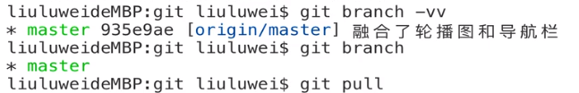

# Sass、webpack 及 Git 的使用


## 一、Sass


### 1. 语法

**嵌套：**

样式可以放在父元素的声明块里面，当编译的时候会变成常见的 css 文件

好处：减少代码量，不容易写错

```html
<div class="container">
    <div class="sidebar">
        Sidebar
    </div>
    <div class="main">
        Main Content
    </div>
</div>
```

```scss
.container {
	max-width: 600px;
	width: 100%;
	margin: auto;
	background: #eee;

	.sidebar,
	.main {
		padding: 10px;
	}

	.main {
		margin-left: 220px;
		min-height: 100vh;
		border-left: 2px solid #333;
	}

	.sidebar {
		width: 200px;
         float: left;
	}
}
```

<br>

**直接子元素（>）：**

```scss
.container {
    >.left-area {
        ...
    }
}
```

<br>

**&选择器：**

```html
<div class="container right-nav">
    ...
</div>
```

```css
.container.right-nav {
    ...
}
```

```scss
.container {
    &.right-nav {
        color: #333;
    }
}
```

<br>

```scss
.button {
    color: #333;
    .theme-dark & {
        color: #fff;
    }
}
```

```css
.button {
    color: #333;
}
.theme-dark .button {
    color: #fff;
}
```


### 2. 模块

@import "模块名"

在 css 中的模块，会产生一个 http 请求


### 3. 变量

```scss
/* 全局变量 */
$error-color: #ccc !default;

/* 局部变量 */ 
.alert-error {
    $text_color: #ddd;
    background-color: $error-color;
    color: $text_color;
    text-shadow: 0 0 2px darken($text_color, 40%);
}
```


### 4. 注释

```scss
/*
编译成css还在
*/

.foo {
    color: red;	// 编译成css没有了
}
```


### 5. Mixins

可以让样式复用

**Mixins 语法：**

```scss
@mixin alert-text {
    background-color: #f00;
    color: white;
    font-variant: small-caps;
}

.error-text {
    @include alert-text;
}
.has-error:after {
    @include alert-text;
   	display: inline-block;
    content: attr(data-error);
}
```

<br>

**Mixins 参数：**

```scss
@mixin alert-text($color) {
    background-color: $color;
    color: white;
    font-variant: small-caps;
}

.error-text {
    @include alert-text(blue);
}
.has-error:after {
    @include alert-text(red);
    display: inline-block;
    content: attr(data-error);
}
```

<br>

**Mixins 默认参数：**

可以给变量默认值，传值的时候按照顺序传也可以指定传，通过键值对的形式

```scss
@mixin alert-text($color: #f33) {
    background-color: $color;
    color: white;
    font-variant: small-caps;
}

h1 {
    @include alert-text(blue);
}

h2 {
    @include alert-text($color: green);
}
```

<br>

**Mixins null：**

```scss
@mixin foo($opacity: null) {
    color: #333;
    opacity: $opacity;
}

.btn {
    @include foo();
}

.other-btn {
    @include foo(0.5);
}
```

```css
.btn {
    color: #333;
}

.other-btn {
    color: #333;
    opacity: 0.5;
}
```

<br>

**Mixins 传一个块：**

```scss
@mixin foo($color) {
    color: $color;
    
    .inner {
        @content
    }
}

.btn {
    @include foo(#c69) {
        color: red;
    }
}
```

```css
.btn {
    color: #c69;
}

.btn .inner {
    color: red;
}
```


### 6. 函数与语句的使用

**函数**

<https://sass-lang.com/documentation/Sass/Script/Functions.html>

<br>

**@if**

```scss
@mixin foo($size) {
    font-size: $size;
    @if $size>20 {
        line-height: $size;
    }
}

.small {
    @include foo(14px);
}

.large {
    @include foo(24px);
}
```

```css
.small {
    font-size: 14px;
}

.large {
    font-size: 24px;
    line-height: 24px;
}
```

<br>

**@for**

字符串插值：`#{}`

```scss
@for $i from 1 through 5 {
    h#{$i} {
        font-size: 5rem - $i*0.75rem;
    }
}
```

```css
h1 {font-size: 4.25rem;}
h2 {font-size: 3.5rem;}
h3 {font-size: 2.75rem;}
h4 {font-size: 2rem;}
h5 {font-size: 1.25rem;}
```

<br>

**Lists**

```scss
$mylist: 0 0 2px #000;

.foo {
    box-shadow: $mylist;
}
```

```css
.foo {
    box-shadow: 0 0 2px #000;
}
```

<br>

**Lists @each**

```scss
$mylist: 0 0 2px #000;

.foo {
    @each $i in $mylist {
        /* #{$i} */
    }
}
```

```css
.foo {
    /* 0 */
    /* 0 */
    /* 2px */
    /* #000 */
}
```

<br>

**Lists nth**

```scss
$gradients:
    (to left top, blue, red),
    (to left top, blue, yellow);

.foo {
    background: linear-gradient(nth($gradient, 2));
}
```

<br>

**Map**

```scss
$mymap: (dark: #009, light: #66f);
@mixin theme-button($t) {
    color: map-get($mymap, $t);
}
.btn-dark {
    @include theme-button('dark');
}
.btn-light {
    @include theme-button('light')
}
```

```css
.btn-dark {
    color: #009;
}
.btn-light {
    color: #66f;
}
```


<br>

## 二、webpack


### 1. 命令行的使用

1. 安装环境 node
2. npm 包管理工具，下载命令 **npm install** 简写 **npm i**，淘宝镜像：npm install -g cnpm --registry=https://registry.npm.taobao.org， 使用 **cnpm**
3. 生成一个项目说明书 **npm init** ，MIT 证书
4. 下载 webpack、webpack-cli，告诉项目说明书开发时的依赖 **--save-dev** 简写 **-D**，运行时的依赖 **--save** 简写 **-S**
5. webpack 安装到了 node_modules 文件夹下
6. mode 模式：生产和开发
7. **--watch** 监听

运行脚本 **npm run 脚本名**

```json
// package.json 
{
  "name": "webpack1",
  "version": "1.0.0",
  "description": "练习webpack",
  "main": "index.js",
  // scripts脚本
  "scripts": {
    "webpack": "webpack",
    // 开发模式
    "dev": "npm run webpack -- --mode development",
    // 生产模式
    "prod": "npm run webpack -- --mode production --watch"
  },
  "keywords": [
    "test",
    "webpack"
  ],
  "author": "li",
  "license": "MIT",
  "devDependencies": {
    "webpack": "^4.33.0",
    "webpack-cli": "^3.3.3"
  }
}
```


### 2. webpack 四个核心概念

- **Entry：** 告诉 webpack 入口文件在哪

  ```js
  // 一个入口
  module.exports = {
      entry: './entry.js',
  }
  
  // 多个入口
  module.exports = {
      entry: {
          entry: './entry.js',
          index: './index.js'
      }
  }
  ```

  

- **Output：** 告诉 webpack 把编译好的文件放在哪里

  ```js
  module.exports = {
      entry: './entry.js',
      output: {
          path: __dirname + '/dist',
          filename: 'bundle.js'
      }
  }
  ```

  

- **Loaders：** 告诉 webpack 在添加到依赖图之前如何转换一个文件，本质就是一个函数

  ```js
  module: {
      rules: [
          {test: /\.ts$/, use: 'ts-loader'},
          {test: /\.js$/, use: 'babel-loader'},
          {test: /\.css$/, use: 'css-loader'}
      ]
  }
  
  module: {
      rules: [
          {
              test: regex,
              use: (Array|String|Function),
              include: RegExp || [RegExp],	// 想让当前文件夹下的哪个文件夹转换
              exclude: RegExp || [RegExp],	// 不想让当前文件夹下的哪个文件夹转换
              issuer: (RegExp|String) || [RegExp|String],
              enforce: 'pre'|'post'
          },
      ],
  }
      
  // loaders链
  rules: [
      {
          test: /\.scss$/,
          use: ['style-loader', 'css-loader', 'sass-loader']
      }
  ]
  ```

  

- **Plugins：** 在编译的过程中添加你想要的任何操作，本质就是构造函数（原型上有 apply 这个属性），在 webpack 的生命周期中触发函数

  ```js
  function BellOnBundlerErrorPlugin() { }
  
  BellOnBundlerErrorPlugin.prototype.apply = function (compiler) {
      if (typeof(process) !== 'undefined') {
          
          // Compiler events that are emitted and handled
          compiler.plugin('done', function (stats) {
              if (stats.hasErrors()) {
              process.stderr.write('\x07');
              }
          });
          
          compiler.plugin('failed', function (err) {
              process.stderr.write('\x07');
          });
      }
  }
  module.exports = BellOnBundlerErrorPlugin;
  ```

  使用：

  ```js
  var BellOnBundlerErrorPlugin = require('bell-on-error');
  module.exports = {
      //...
      plugins: [
          new BellOnBundlerErrorPlugin(),
      ]
      //...
  }
  ```


**配置文件**

插件 html-webpack-plugin，webpack-dev-server 开测试服务器，webpack-merge

```js
// 配置文件 webpack.config.js
const htmlWebpackPlugin = require("html-webpack-plugin");
const webpack = require("webpack");
const webpackMerge = require("webpack-merge");
const configMode = (mode) => {
    return require(`./build-utils/webpack.${mode}.js`);
}
module.exports = ({mode}) => {
    return webpackMerge({
        mode,
        entry: "./src/index1.js",
        plugins: [
            new htmlWebpackPlugin({
                template: "./index.html"
            }),
            new webpack.ProgressPlugin()
        ]
    }, configMode(mode))
}
```

```json
// package.json scripts
{
  "scripts": {
    "webpack": "webpack",
    "webpack-dev-server": "webpack-dev-server",
    "dev": "npm run webpack-dev-server -- --env.mode development",
    "prod": "npm run webpack -- --env.mode production"
  },
}
```

```js
// build-utils/webpack.development.js
module.exports = {
    output: {
        filename: "bundle.js"
    }
}
```

```js
// build-utils/webpack.production.js
module.exports = {
    output: {
        filename: "[chunkhash].js"
    }
}
```


### 3. 配置优化

css 转换插件： sass-loader、 node-sass、 css-loader、 style-loader、 mini-css-extract-plugin

ES6 转 ES5 插件： babel-loader、 @babel/core、 @babel/preset-env	

自动清理 dist 文件夹插件： clean-webpack-plugin

引入图片插件： url-loader、 file-loader

分析文件大小插件： webpack-bundle-analyzer， 命令 npm run prod -- --env.presets analyzer

```js
// 配置文件 webpack.config.js
const htmlWebpackPlugin = require("html-webpack-plugin");
const webpack = require("webpack");
const webpackMerge = require("webpack-merge");
const loadPresets = require("./build-utils/loadPresets");
const configMode = (mode) => {
    return require(`./build-utils/webpack.${mode}.js`);
}
module.exports = ({mode, presets}) => {
    return webpackMerge({
        mode,
        entry: "./src/index1.js",
        module: {
            rules: [{
                test: /\.js$/,
                exclude: /node_modules/,
                use: [{
                    loader: "babel-loader",
                    options: {
                        presets: ["@babel/preset-env"]
                    }
                }]
            }, {
                test: /\.jpe?g$/,
                use: [{
                    loader: "url-loader",
                    options: {
                        limit: 5000
                    }
                }]
            }]
        },
        plugins: [
            new htmlWebpackPlugin({
                template: "./index.html"
            }),
            new webpack.ProgressPlugin()
        ]
    }, 
        configMode(mode),
        loadPresets(presets)
    )
}
```

```json
// package.json 脚本
"scripts": {
    "webpack": "webpack",
    "webpack-dev-server": "webpack-dev-server",
    "dev": "npm run webpack-dev-server -- --env.mode development --hot",
    "prod": "npm run webpack -- --env.mode production",
    "prod:alz": "npm run prod -- --env.presets analyzer"
}
```

```js
// build-utils/webpack.developments.js
module.exports = {
    devtool: "source-map",
    output: {
        filename: "bundle.js"
    },
    module: {
        rules: [{
            test: /\.scss$/,
            use: ["style-loader", "css-loader", "sass-loader"]
        }]
    }
}
```

```js
// build-utils/webpack.production.js
const MiniCssExtractPlugin = require('mini-css-extract-plugin');
module.exports = {
    output: {
        filename: "[name].[chunkhash].js"
    },
    module: {
        rules: [{
            test: /\.scss$/,
            use: [MiniCssExtractPlugin.loader, "css-loader", "sass-loader"]
        }]
    },
    plugins: [
        new MiniCssExtractPlugin()
    ]
}
```

```js
// build-utils/loadPresets.js
const webpackMerge = require("webpack-merge");
module.exports = (presets) => {
    presets = presets || [];
    const mergePresets = [].concat(presets);
    const mergeConfig = mergePresets.map((presetName) => {
        return require(`./presets/webpack.${presetName}`);
    })
    return webpackMerge({}, ...mergeConfig);
}
```

```js
// build-utils/presets/webpack.analyzer.js
const BundleAnalyzerPlugin = require('webpack-bundle-analyzer').BundleAnalyzerPlugin;
module.exports = {
    plugins: [new BundleAnalyzerPlugin()]
}
```


### 4. 代码分离

**性能优化最优目标：**

<=200KB 的初始化 JavaScript

<=100KB 的初始化 css

http：<= 6 个请求

http/2：<= 20 个请求

90% 的代码覆盖率  10% 未使用代码


**代码分离方式：**

- 静态拆分
- “动态”导入

插件：@babel/plugin-syntax-dynamic-import

```js
// 配置文件 webpack.config.js
const htmlWebpackPlugin = require("html-webpack-plugin");
const webpack = require("webpack");
const webpackMerge = require("webpack-merge");
const loadPresets = require("./build-utils/loadPresets");
const configMode = (mode) => {
    return require(`./build-utils/webpack.${mode}.js`);
}
module.exports = ({mode, presets}) => {
    return webpackMerge({
        mode,
        entry: "./src/index1.js",
        module: {
            rules: [{
                test: /\.js$/,
                exclude: /node_modules/,
                use: [{
                    loader: "babel-loader",
                    options: {
                        presets: ["@babel/preset-env"],
                        plugins: ["@babel/plugin-syntax-dynamic-import"]
                    }
                }]
            }, {
                test: /\.jpe?g$/,
                use: [{
                    loader: "url-loader",
                    options: {
                        limit: 5000
                    }
                }]
            }]
        },
        plugins: [
            new htmlWebpackPlugin({
                template: "./index.html"
            }),
            new webpack.ProgressPlugin()
        ]
    }, 
        configMode(mode),
        loadPresets(presets)
    )
}
```

```js
// index.js "动态"导入
button.onclick = function () {
    import("./footer").then(footer => {
        document.body.appendChild(footer.divTop);
        document.body.appendChild(footer.divBottom);
    })   
}
```


### 5. 代码的配置

`/* webpackPrefetch: true */`： 预加载

`/* webpackChunkName: "name" */`：给打包出来的 js 文件命名

`/* webpackMode: "lazy-once" */`：开发模式使用，代码分离模式，查找文件夹里使用了的文件

```js
// index.js
import makeButton from "./button";
const getfooter = () => import(
    /* webpackPrefetch: true */
    /* webpackChunkName: "footer" */ 
    "./footer");
const getLodash = () => import(/* webpackChunkName: "lodash" */ "lodash-es");
if (process.env.NODE_ENV == "development") {
    var setButtonStyle = (color) => import(/* webpackMode: "lazy-once" */ `./buttonStyle/${color}`);
} else if (process.env.NODE_ENV == "production") {
    var setButtonStyle = (color) => import(`./buttonStyle/${color}`);
}

const button = makeButton("按钮");
document.body.appendChild(button);
button.onclick = function(){
    getfooter().then(footer => {
        document.body.appendChild(footer.divTop);
        document.body.appendChild(footer.divBottom);
    })
    getLodash().then((_) => {
        console.log(_);
    })
    setButtonStyle("yellow").then((obj) => {
        console.log(obj.default);
    }) 
}
```


<br>

## 三、Git

### 1. Git 基础语法

**Git 配置**

用户信息：

git config --global user.name "name"

git config --global user.email "123@qq.com"

检查配置：git config --list

<br>

**获取 Git 仓库**

从现有的目录中初始化：git init

克隆现有的仓库：git clone url

<br>

**Git 更新状态命令**

追踪文件与暂存已经修改文件：git add

提交更新：git commit 

查看状态：git status

查看修改：

* git diff：比较工作目录和暂存区

* git diff --staged：比较暂存区和上一个版本
* git diff HEAD：比较工作目录和上一个版本

<br>

**Git 查看提交历史**

git log

<br>

**Git 撤销**

撤销到暂存：git checkout -- \<file>

撤销暂存：git reset HEAD \<file>

<br>

### 2. Git 分支详解

Git 分支：指针

默认分支 master

**创建分支**

git branch \<分支名>

**查看分支**

git branch：查看本地分支

git branch -va：查看所有分支

**删除本地分支**

git branch -d \<分支名>

**分支切换**

git checkout \<分支名>

**合并分支**

git merge \<分支名>：合并分支到当前分支

<br>

### 3. 远程仓库的使用

**以本地仓库为基准**

git remote，git remote -v

添加远程连接

git remote add \<name> url

推送

git push \<name> \<branch>

输入 git push -u origin master 后，git push 默认推送到 origin 上的 master 分支

<br>

**多人协作**

拉取：git fetch \<name>

合并：get merge \<branch>

拉取加合并：git pull \<name> \<branch>

推送：git push \<name> \<branch>

git branch -vv 查看本地分支和远程仓库分支是否有联系，有则拉取加合并简写成：git pull



<br>

### 4. 项目开发中使用 Git

**集中式工作流**

克隆中央仓库

敲代码

git pull --rebase

解决冲突

git add .

git rebase --continue

git push

<br>

**功能分支工作流**

新建分支开发

开发完上传到远程仓库分支

pull request

接受或者修改

